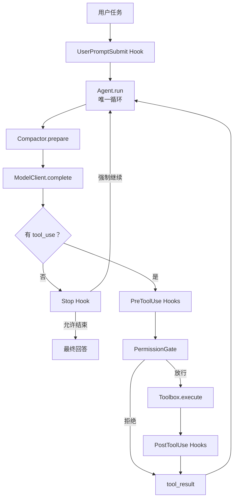
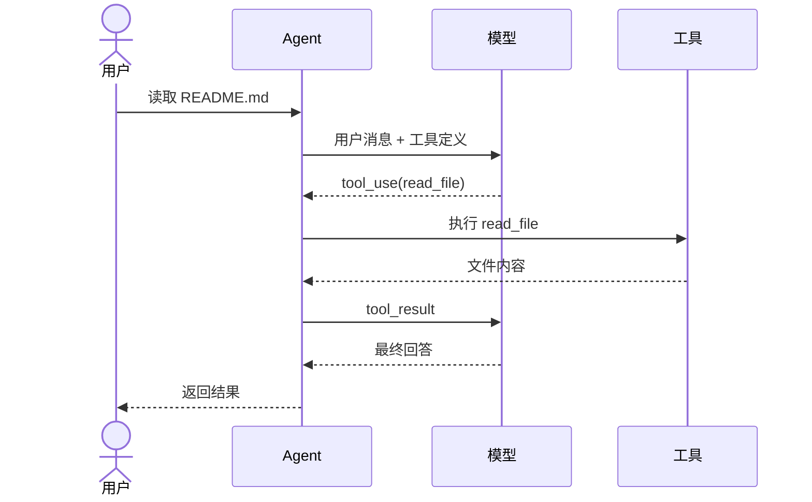
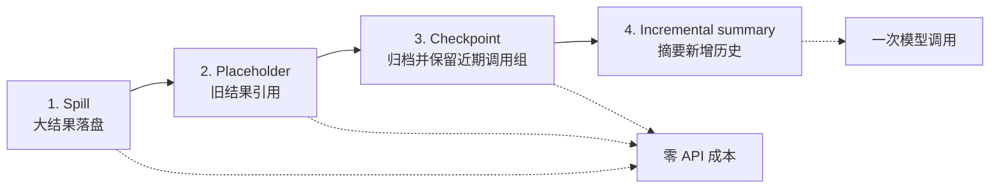

<div align="center">

# AgentLoop

**面向本地开发任务的 Coding Agent**

`Python 3.10+` · `OpenAI / Anthropic` · `offline test suite` · `MIT`

集成上下文工程、会话记忆、权限管理和工具执行，支持命令行、Web 与 macOS 桌面使用。

[核心能力](#核心能力) · [快速开始](#快速开始) · [架构](#架构) ·
[设计选型与验证](docs/context-design.md) · [实现详解](docs/study-guide.md) · [开发与测试](#开发与测试)

</div>

---

AgentLoop 是我开发的本地 Coding Agent，围绕“理解任务、调用工具、读取结果、继续执行”
构建完整执行流程。它可以读取和修改项目文件、运行命令、维护任务计划，并通过多轮
模型与工具交互完成开发任务。

## 核心能力

- **上下文工程**：按完整请求预算管理系统提示、工具定义和消息；分级压缩、可回读归档与增量摘要控制长任务上下文。
- **会话记忆**：用短期上下文承接多轮任务，用持久化会话和历史归档长期保存执行记录，支持恢复已有会话。
- **权限管理**：在工具执行前统一检查权限，对禁止操作直接拒绝，对风险命令请求人工审批。
- **工具系统**：统一注册和分发文件读写、内容编辑、文件查找、Shell 执行与任务计划工具，将执行结果和错误回填给模型。
- **模型接入与容错**：支持 OpenAI 兼容协议和 Anthropic 原生协议，提供失败重试、多模型切换与离线回放。
- **交互与任务控制**：提供 CLI、Web 和 macOS 桌面入口，支持流式输出、多会话管理、工具过程展示与任务取消。

### 上下文工程

实现“大结果落盘 → 旧结果引用 → 统一 checkpoint → 增量摘要”的分级管线。
预算覆盖系统提示、工具定义与消息；超大最新工具结果同样会先落盘，保留首尾和错误相关采样及原文路径。压缩过程中保护工具调用与工具结果的配对关系；本地预算仍无法满足时明确报错停止，模型报告超限时可再做一次补救压缩。

### 短期记忆与长期保存

短期记忆由当前会话的消息历史、工具结果和压缩摘要组成，让 Agent 在连续交互中
承接已有任务。Web 会话按工作区持久化，重新打开后可以恢复；大段工具输出和历史
记录另行落盘，保留后续查阅依据。

当前的长期保存以会话恢复和文件归档为基础，尚未实现跨会话知识提取、语义检索与自动召回。

上下文压缩按 `source_id` 有序保存用户原文；旧工具结果先保存原文再替换为路径，摘要失败或截断时把待处理历史保留为可重放归档。方案比较、字段设计和离线实验见
[上下文工程：从选型到验证](docs/context-design.md)。

### 权限管理与工具系统

工具执行经过统一权限入口，结合硬拒绝规则、风险识别和人工审批控制操作。
文件工具限制工作区路径，Shell 工具支持超时、输出截断和取消；任务停止时终止正在
执行的 Shell 子进程组。工具执行失败会作为结果反馈给模型，供后续调整执行步骤。

工具注册表与 Agent 主循环分离；输入、工具执行前后和任务停止四类 Hook 提供扩展点，
便于接入输入处理、权限策略和执行记录。当前权限规则基于模式匹配，不提供生产级 Shell 沙箱隔离。

## 快速开始

### 1. 安装

需要 Python 3.10 或更高版本。

```bash
git clone https://github.com/still0123/agentloop.git
cd agentloop
python3.11 -m venv .venv
source .venv/bin/activate
python -m pip install -e ".[dev]"
cp .env.example .env
```

### 2. 配置模型

编辑 `.env`，至少配置一个模型。以 DeepSeek 为例：

```dotenv
AGENTLOOP_MODEL=deepseek-chat
DEEPSEEK_API_KEY=sk-...
```

也可以连接本地 Ollama 或其他 OpenAI 兼容端点：

```dotenv
AGENTLOOP_MODEL=llama3
AGENTLOOP_BASE_URL=http://localhost:11434/v1
AGENTLOOP_API_KEY=ollama
```

### 3. 运行

单次任务：

```bash
python -m agentloop "列出当前目录中的 Python 文件"
```

连续会话：

```bash
python -m agentloop
```

本地 Web UI：

```bash
agentloop web
```

Web 会话按工作区自动保存，支持创建、切换、改名和删除，模型文本按 Token
增量显示。运行中可点击“停止”取消任务；正在执行的 `bash` 命令会终止整个
子进程组。

## Web UI

| 工具执行与流式回答 | 危险命令权限审批 |
|---|---|
|  |  |

### 4. macOS 桌面应用

桌面版使用 pywebview 将同一套本地 Web UI 放入原生窗口，不引入 Electron 或
额外服务框架。先准备桌面配置：

```bash
mkdir -p ~/.agentloop
cp .env.example ~/.agentloop/.env
# 编辑 ~/.agentloop/.env；可选设置 AGENTLOOP_WORKDIR=/path/to/project
```

安装构建依赖并生成应用：

```bash
python -m pip install -e ".[dev,desktop]"
make macos-app
open dist/AgentLoop.app
```

生成可安装的 PKG 和拖拽安装的 DMG：

```bash
make macos-package
ls dist/installers/
```

应用默认使用 `~/.agentloop/workspace`；也可以通过 `AGENTLOOP_WORKDIR` 指向可信项目。
当前产物使用本机临时签名，适合自用；公开分发前仍需 Developer ID 签名和公证。

不配置模型也能运行全部离线测试：

```bash
make check
```

## 架构



一次工具调用通常需要两轮模型请求：



`Agent.run` 是唯一循环。增加工具只改工具箱，增加策略只注册 Hook，接入新模型只改
适配边界。

## 已实现能力

| 能力 | 实现 | 代码入口 |
|---|---|---|
| Agent Loop | 以“无 `tool_use`”为自然退出信号，带最大轮数保护 | [`agent.py`](agentloop/agent.py) |
| 工具系统 | 7 个工具，注册表分发，错误回填给模型 | [`tools.py`](agentloop/tools.py) |
| 权限闸门 | 硬拒绝、风险识别、人工审批 | [`permission.py`](agentloop/permission.py) |
| 生命周期 Hooks | 输入、执行前、执行后、停止四个事件 | [`hooks.py`](agentloop/hooks.py) |
| 计划约束 | `todo_write` 状态校验和三轮提醒 | [`tools.py`](agentloop/tools.py) |
| 上下文压缩 | 转存、归档、占位、摘要四级管线 | [`compact.py`](agentloop/compact.py) |
| 模型路由 | OpenAI 兼容协议、Anthropic 原生协议、Mock、Fallback | [`models.py`](agentloop/models.py) |
| CLI | 单次任务、保留历史的 REPL、token 统计 | [`cli.py`](agentloop/cli.py) |
| Web UI | Token 流式、断线重放、权限审批、多会话、任务取消 | [`web.py`](agentloop/web.py) |
| macOS 桌面壳 | 原生窗口、复用 Web UI、关闭时停止服务和任务 | [`desktop.py`](agentloop/desktop.py) |

### 内置工具

| 工具 | 用途 | 保护措施 |
|---|---|---|
| `bash` | 执行 shell 命令 | 超时、取消、输出截断、权限 Hook |
| `read_file` | 按 1-based 行号分页读取文本 | 工作区路径限制、页大小上限、下一页提示 |
| `search_file` | 字面搜索归档或日志 | 工作区路径限制、行号与有界上下文 |
| `write_file` | 创建或覆盖文件 | 工作区路径限制 |
| `edit_file` | 精确替换首个匹配 | 工作区路径限制 |
| `glob` | 查找文件 | 数量上限 |
| `todo_write` | 更新会话计划 | 数量和状态校验 |

## 上下文压缩

压缩按信息损失和成本从低到高执行；完整请求预算包含 `system + tools + messages`。默认以 UTF-8 字节作保守估计，不是精确 tokenizer，部署方可注入对应模型的估算器。



管线始终保护 `tool_use` 与 `tool_result` 的配对关系。大结果会先保存到
`.task_outputs/`，完整历史会归档到 `.transcripts/`；记录不会由本机制自动删除。模型可用 `search_file` 定位归档，再用 `read_file` 的 `offset/limit` 分页回读。

当前字段、预算与重放流程见 **[上下文设计与验证](docs/context-design.md)**；
基础消息配对原理见 [实现详解](docs/study-guide.md#9-上下文压缩)。

## 模型配置

| 模型名前缀 | 提供商 | API Key 环境变量 |
|---|---|---|
| `glm`、`chatglm` | 智谱 GLM | `GLM_API_KEY` 或 `ZHIPU_API_KEY` |
| `deepseek` | DeepSeek | `DEEPSEEK_API_KEY` |
| `qwen`、`qwq` | 通义千问 | `DASHSCOPE_API_KEY` 或 `QWEN_API_KEY` |
| `moonshot`、`kimi` | Moonshot | `MOONSHOT_API_KEY` |
| `claude` | Anthropic | `ANTHROPIC_API_KEY` |
| `gpt-`、`o1`、`o3`、`o4` | OpenAI | `OPENAI_API_KEY` |

可选配置：

```dotenv
# 显式指定提供商
AGENTLOOP_PROVIDER=anthropic

# 覆盖默认端点与密钥
AGENTLOOP_BASE_URL=https://example.com/v1
AGENTLOOP_API_KEY=...

# 主模型失败后按顺序切换
AGENTLOOP_FALLBACK_MODELS=deepseek-chat,qwen-max

# 单次回复 token 上限
AGENTLOOP_MAX_TOKENS=8000

# 完整请求的上下文窗口与安全余量；默认 64000 / 8000 / 2000。
# 默认估算是保守 UTF-8 字节数，不是提供商精确 token 计数。
AGENTLOOP_CONTEXT_TOKENS=64000
AGENTLOOP_CONTEXT_MARGIN=2000
```

单个客户端会先对 429、部分 5xx、超时和传输错误做指数退避；重试耗尽并转成
`ModelError` 后，`FallbackClient` 才会切换到下一个模型。

## 实现详解

完整技术文档位于 **[`docs/study-guide.md`](docs/study-guide.md)**，包含：

1. 一条请求从 CLI 到最终回答的完整时序；
2. `tool_use` / `tool_result` 内部消息协议；
3. `Agent.run` 核心循环逐段解析；
4. 工具注册、异常回填和工作区路径保护；
5. Hook 短路规则与三道权限闸门；
6. 四级上下文压缩和消息配对保护；
7. OpenAI / Anthropic 协议适配、重试与 Fallback；
8. 测试证据、扩展练习和生产化边界。

推荐第一次按下面顺序读：

```text
test_tool_roundtrip
  -> Agent.run
  -> MockClient
  -> Toolbox
  -> HookRegistry
  -> PermissionGate
  -> Compactor
  -> build_client
```

## 开发与测试

```bash
# 安装开发依赖
make install

# 自动修复 lint，并统一格式
make format

# 只检查，不改文件
make lint

# 运行测试
make test

# 提交前完整检查
make check

# 构建 macOS 应用和安装包
make macos-app
make macos-package
```

CI 使用 Python 3.10–3.13 矩阵执行同样的 Ruff 和 Pytest 检查。格式与静态规则
统一定义在 `pyproject.toml`，编辑器基础行为定义在 `.editorconfig`。

测试全部离线运行，具体数量以 `pytest -q` 输出为准。

## 项目边界

当前版本有意不包含：

- 生产级 shell 沙箱；
- Subagent、MCP、Skills、跨会话长期记忆检索与自动召回、任务图；
- 多用户服务端数据库和远程访问；
- 多工具并发执行。

这些能力不应直接塞进核心循环。合适的扩展位置分别是工具层、Hook、上下文层或模型
适配层。具体风险与演进方向见
[学习手册的生产化章节](docs/study-guide.md#14-边界风险与生产化方向)。

## License

[MIT](LICENSE) © 2026 AgentLoop contributors
