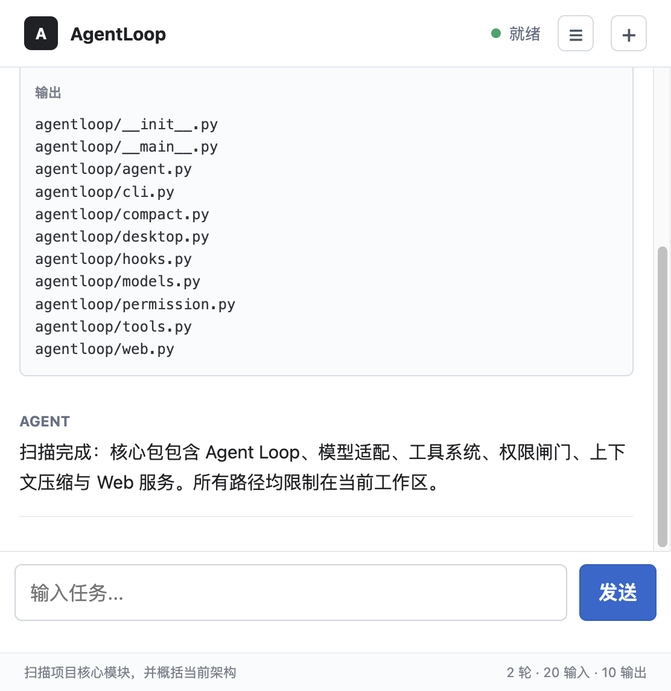
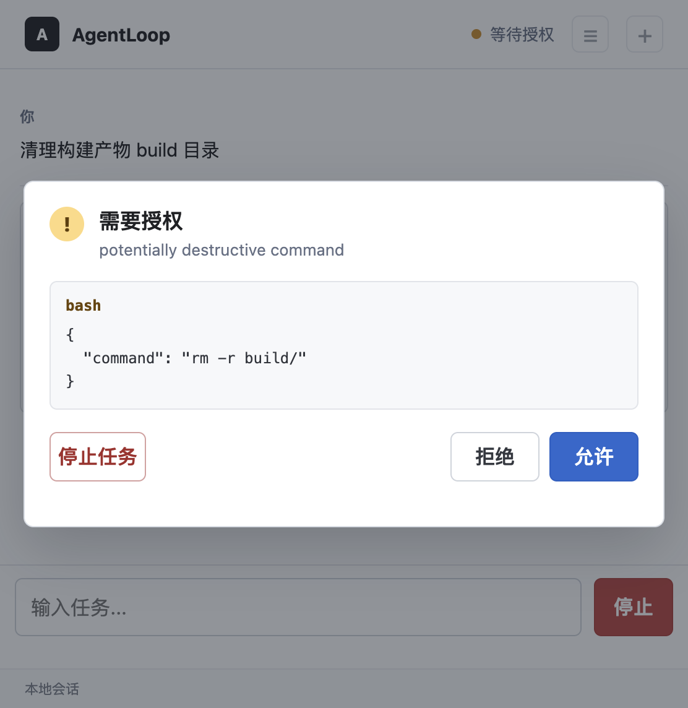
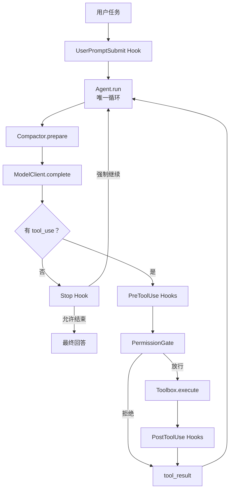
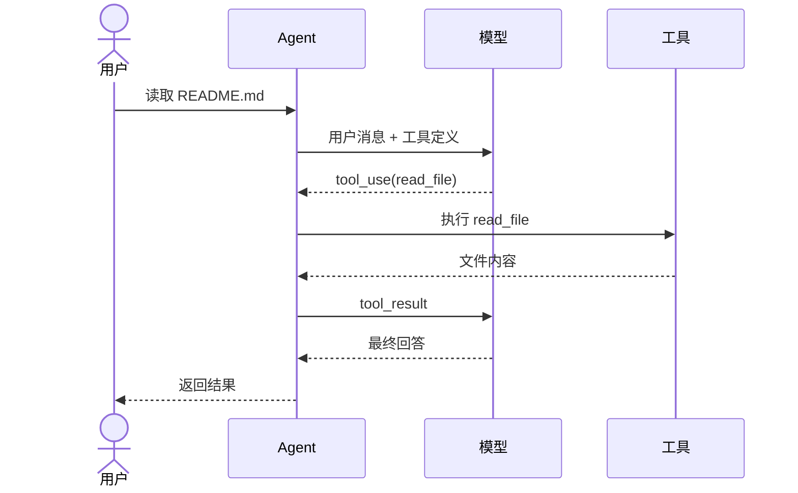
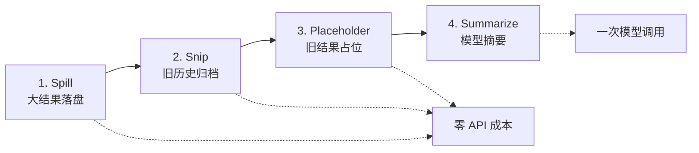

<div align="center">

# AgentLoop

**一个能逐行读懂的 Coding Agent Harness**

`Python 3.10+` · `OpenAI / Anthropic` · `offline test suite` · `MIT`

把模型调用、工具执行、权限控制、上下文压缩和故障切换放进一个小而完整的工程。

[快速开始](#快速开始) · [架构](#架构) ·
[完整学习手册](docs/study-guide.md) · [开发与测试](#开发与测试)

</div>

---

AgentLoop 是一个单机、多会话的 Coding Agent 实现。它从
[learn-claude-code](https://github.com/shareAI-lab/learn-claude-code)
的课程结构出发，保留清晰的学习来源，并补上多提供商路由、权限闸门、上下文压缩、
Fallback 和离线测试。

项目重点不是功能数量，而是让每个关键机制都能被定位、运行和验证：

- 核心循环只负责“调用模型 -> 执行工具 -> 回填结果”；
- 工具、权限、Hooks、压缩和模型协议各自有明确边界；
- 完整测试套件使用 `MockClient` 回放，不需要网络或 API Key；
- 文档明确说明教学实现与生产级系统之间的差距。

> [!IMPORTANT]
> AgentLoop 会在本机执行模型请求的工具操作。当前权限规则是教学级防线，不是安全
> 沙箱。请只在可信目录和可控环境中运行。

## 快速开始

### 1. 安装

需要 Python 3.10 或更高版本。

```bash
git clone https://github.com/still0123/agentloop.git
cd agentloop
python3.11 -m venv .venv
source .venv/bin/activate
python -m pip install -e ".[dev]"
cp .env.example .env
```

### 2. 配置模型

编辑 `.env`，至少配置一个模型。以 DeepSeek 为例：

```dotenv
AGENTLOOP_MODEL=deepseek-chat
DEEPSEEK_API_KEY=sk-...
```

也可以连接本地 Ollama 或其他 OpenAI 兼容端点：

```dotenv
AGENTLOOP_MODEL=llama3
AGENTLOOP_BASE_URL=http://localhost:11434/v1
AGENTLOOP_API_KEY=ollama
```

### 3. 运行

单次任务：

```bash
python -m agentloop "列出当前目录中的 Python 文件"
```

连续会话：

```bash
python -m agentloop
```

本地 Web UI：

```bash
agentloop web
```

Web 会话按工作区自动保存，支持创建、切换、改名和删除，模型文本按 Token
增量显示。运行中可点击“停止”取消任务；正在执行的 `bash` 命令会终止整个
子进程组。

## Web UI

| 工具执行与流式回答 | 危险命令权限审批 |
|---|---|
|  |  |

不配置模型也能运行全部离线测试：

```bash
make check
```

## 架构



一次工具调用通常需要两轮模型请求：



`Agent.run` 是唯一循环。增加工具只改工具箱，增加策略只注册 Hook，接入新模型只改
适配边界。

## 已实现能力

| 能力 | 实现 | 代码入口 |
|---|---|---|
| Agent Loop | 以“无 `tool_use`”为自然退出信号，带最大轮数保护 | [`agent.py`](agentloop/agent.py) |
| 工具系统 | 6 个工具，注册表分发，错误回填给模型 | [`tools.py`](agentloop/tools.py) |
| 权限闸门 | 硬拒绝、风险识别、人工审批 | [`permission.py`](agentloop/permission.py) |
| 生命周期 Hooks | 输入、执行前、执行后、停止四个事件 | [`hooks.py`](agentloop/hooks.py) |
| 计划约束 | `todo_write` 状态校验和三轮提醒 | [`tools.py`](agentloop/tools.py) |
| 上下文压缩 | 转存、归档、占位、摘要四级管线 | [`compact.py`](agentloop/compact.py) |
| 模型路由 | OpenAI 兼容协议、Anthropic 原生协议、Mock、Fallback | [`models.py`](agentloop/models.py) |
| CLI | 单次任务、保留历史的 REPL、token 统计 | [`cli.py`](agentloop/cli.py) |
| Web UI | Token 流式、断线重放、权限审批、多会话、任务取消 | [`web.py`](agentloop/web.py) |

### 内置工具

| 工具 | 用途 | 保护措施 |
|---|---|---|
| `bash` | 执行 shell 命令 | 超时、取消、输出截断、权限 Hook |
| `read_file` | 读取文本文件 | 工作区路径限制 |
| `write_file` | 创建或覆盖文件 | 工作区路径限制 |
| `edit_file` | 精确替换首个匹配 | 工作区路径限制 |
| `glob` | 查找文件 | 数量上限 |
| `todo_write` | 更新会话计划 | 数量和状态校验 |

## 上下文压缩

压缩按信息损失和成本从低到高执行：



管线始终保护 `tool_use` 与 `tool_result` 的配对关系。大结果会先保存到
`.task_outputs/`，完整历史会归档到 `.transcripts/`，两者默认都不提交 Git。

完整原理、消息切片图和配对不变量见
**[AgentLoop 学习手册：上下文压缩](docs/study-guide.md#9-上下文压缩)**。

## 模型配置

| 模型名前缀 | 提供商 | API Key 环境变量 |
|---|---|---|
| `glm`、`chatglm` | 智谱 GLM | `GLM_API_KEY` 或 `ZHIPU_API_KEY` |
| `deepseek` | DeepSeek | `DEEPSEEK_API_KEY` |
| `qwen`、`qwq` | 通义千问 | `DASHSCOPE_API_KEY` 或 `QWEN_API_KEY` |
| `moonshot`、`kimi` | Moonshot | `MOONSHOT_API_KEY` |
| `claude` | Anthropic | `ANTHROPIC_API_KEY` |
| `gpt-`、`o1`、`o3`、`o4` | OpenAI | `OPENAI_API_KEY` |

可选配置：

```dotenv
# 显式指定提供商
AGENTLOOP_PROVIDER=anthropic

# 覆盖默认端点与密钥
AGENTLOOP_BASE_URL=https://example.com/v1
AGENTLOOP_API_KEY=...

# 主模型失败后按顺序切换
AGENTLOOP_FALLBACK_MODELS=deepseek-chat,qwen-max

# 单次回复 token 上限
AGENTLOOP_MAX_TOKENS=8000
```

单个客户端会先对 429、部分 5xx、超时和传输错误做指数退避；重试耗尽并转成
`ModelError` 后，`FallbackClient` 才会切换到下一个模型。

## 学习路线

完整教程位于 **[`docs/study-guide.md`](docs/study-guide.md)**，包含：

1. 一条请求从 CLI 到最终回答的完整时序；
2. `tool_use` / `tool_result` 内部消息协议；
3. `Agent.run` 核心循环逐段解析；
4. 工具注册、异常回填和工作区路径保护；
5. Hook 短路规则与三道权限闸门；
6. 四级上下文压缩和消息配对保护；
7. OpenAI / Anthropic 协议适配、重试与 Fallback；
8. 测试证据、扩展练习和生产化边界。

推荐第一次按下面顺序读：

```text
test_tool_roundtrip
  -> Agent.run
  -> MockClient
  -> Toolbox
  -> HookRegistry
  -> PermissionGate
  -> Compactor
  -> build_client
```

## 开发与测试

```bash
# 安装开发依赖
make install

# 自动修复 lint，并统一格式
make format

# 只检查，不改文件
make lint

# 运行测试
make test

# 提交前完整检查
make check
```

CI 使用 Python 3.10–3.13 矩阵执行同样的 Ruff 和 Pytest 检查。格式与静态规则
统一定义在 `pyproject.toml`，编辑器基础行为定义在 `.editorconfig`。

测试全部离线运行，具体数量以 `pytest -q` 输出为准。

## 项目边界

当前版本有意不包含：

- 生产级 shell 沙箱；
- Subagent、MCP、Skills、长期记忆和任务图；
- 多用户服务端数据库和远程访问；
- 桌面安装包；
- 多工具并发执行。

这些能力不应直接塞进核心循环。合适的扩展位置分别是工具层、Hook、上下文层或模型
适配层。具体风险与演进方向见
[学习手册的生产化章节](docs/study-guide.md#14-边界风险与生产化方向)。

## 来源与致谢

AgentLoop 在深入学习
[shareAI-lab/learn-claude-code](https://github.com/shareAI-lab/learn-claude-code)
后从零实现。项目保留课程概念和章节映射，不把课程思想包装成原创发明。

## License

[MIT](LICENSE) © 2026 AgentLoop contributors
