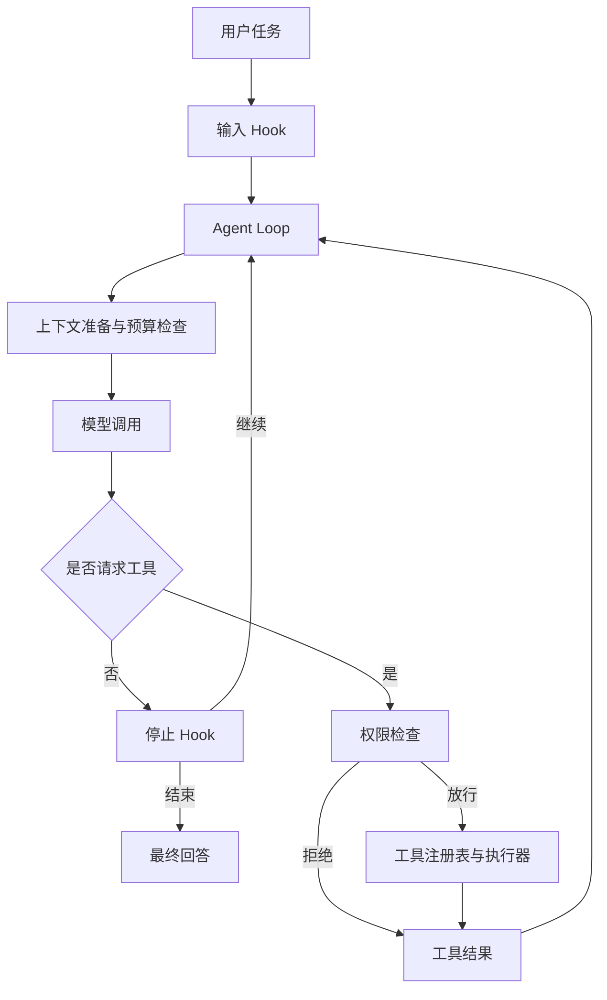
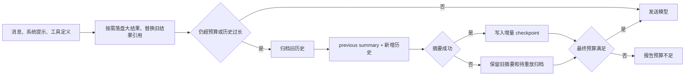

<div align="center">

# AgentLoop

**可扩展的通用 AI Agent**

`Python 3.10+` · `OpenAI-compatible / Anthropic` · `CLI / Web / macOS` · `MIT`

[核心能力](#核心能力) · [使用场景](#使用场景) · [架构](#架构) · [上下文机制](#上下文机制) · [验证](#验证) · [快速开始](#快速开始)

</div>

---

AgentLoop 集成工具调用、权限控制与上下文管理，支持文件处理、日志分析、代码辅助等多轮任务，可通过注册工具扩展应用场景。模型决定下一步行动，工具执行并返回观察结果，循环持续到模型给出最终回答或达到运行保护条件。

项目重点解决长任务中的执行连续性：在多轮工具调用中控制上下文规模、保留用户关键要求，并在摘要失败后保留待处理历史，供后续压缩重放。执行核心通过工具注册表和生命周期 Hook 扩展，当前内置文件、Shell、搜索和任务计划工具，提供 CLI、Web 和 macOS 桌面入口。

## 核心能力

| 模块 | 能力 | 代码入口 |
|---|---|---|
| Agent Loop | 多轮执行、轮数上限、收尾预算、重复结果提示、完成与取消区分 | [agent.py](agentloop/agent.py) |
| 上下文管理 | 完整请求预算、大结果归档、增量摘要、失败重放与文件回读 | [compact.py](agentloop/compact.py) |
| 工具系统 | 按需组合文件、搜索、Shell 和计划工具；命令输出落盘回读 | [tools.py](agentloop/tools.py) / [command.py](agentloop/command.py) |
| 标识符引用 | 为已核验的值生成稳定短编号，校验任务范围与类型，保留来源 | [references.py](agentloop/references.py) |
| 权限控制 | 硬拒绝、风险识别和交互式审批 | [permission.py](agentloop/permission.py) |
| 生命周期扩展 | 输入、工具前后、停止四类 Hook | [hooks.py](agentloop/hooks.py) |
| 模型接入 | OpenAI 兼容协议、Anthropic 协议、重试与回退 | [models.py](agentloop/models.py) |
| 交互界面 | CLI、Web 会话和 macOS 桌面壳 | [cli.py](agentloop/cli.py) / [web.py](agentloop/web.py) |

工具调用经过统一入口。文件工具检查工作区或调用方指定的只读根目录；Shell 工具支持超时、取消和输出上限，并保存本地输出供回读。权限规则会拒绝命中硬规则的操作，并将风险操作交给调用方审批。当前规则是本地执行策略，不构成 Shell 沙箱。

## 使用场景

以下任务使用同一套执行循环和上下文机制，具体步骤由模型结合工具结果决定。

| 场景 | 示例请求 | 预期产出 |
|---|---|---|
| 文件处理 | “读取 `notes/` 中的 Markdown 文件，按主题整理索引，写入 `notes-index.md`，保留源文件。” | 带源文件路径的主题索引 |
| 日志分析 | “检查 `logs/service.log` 中的错误，定位相关行并说明可能原因，只分析，不修改源日志。” | 错误位置、原文证据与原因分析 |
| 代码辅助 | “检查 `src/` 和 `tests/`，修复已确认的问题，运行相关测试并报告结果。” | 代码修改、验证命令与执行结果 |

运行示例前，请准备对应文件并替换为实际路径。这些示例用于说明任务入口，评估范围见[验证](#验证)。

## 架构



消息历史使用有序列表，保留模型输出、工具调用和结果的先后关系；工具注册表按名称映射到描述、参数 schema 和 handler。每轮模型调用前，`Compactor.prepare()` 生成满足预算的消息列表；工具结果写回历史后，循环进入下一轮决策。

轮数上限限制模型决策次数，最后一轮请求的工具仍会经过权限检查并执行。调用方可以预留收尾轮次，只开放报告等完成工具；提交成功后通过完成回调退出，无需再请求模型确认。相同参数反复取得相同结果时，运行时提示模型重新判断，不缓存结果或强制指定业务步骤。集成方式与时间预算边界见[执行控制](docs/runtime.md)。

## 上下文机制

长任务中的上下文由当前消息、摘要和本地归档共同组成。实现采用“程序归档与采样 + 增量摘要”的组合：保存已获取的原始结果，同时控制送入模型的请求规模。



关键机制：

- **完整请求预算**：估算系统提示、工具定义与消息，另外预留输出容量。默认估算器按 UTF-8 字节计数，作为保守的应用层预算；可替换为提供商对应的 tokenizer。
- **大结果归档**：超预算的工具输出保存为本地文件，消息中保留首尾、错误相关片段和路径引用。`search_file` 可定位内容，归档通过 `read_file(char_offset, max_chars)` 分页回读并保持原始引用。
- **近期结果保留**：请求预算足够时保留原始结果；预算紧张时优先淘汰较旧结果，保护最新调用组。
- **增量 checkpoint**：历史消息达到阈值或仍不满足预算时，压缩较早部分并保留近期完整消息组。工具调用与结果的关联不会在切点被拆开。
- **请求原文记录**：检查点按顺序保存用户输入的原文与来源 ID，避免摘要改写早期要求。后续要求如何覆盖或修改早期要求，仍由模型在上下文中判断。
- **失败恢复**：摘要为空、过长、明确截断或调用失败时，优先保留上次有效摘要，并归档未处理历史；再次触发摘要时按预算重放。最终预算不足则明确报错。

本地持久化当前以会话恢复和归档回读为主。它不提供跨会话的语义知识库、自动检索或自动召回。

## 权限审批

Web UI 会在风险命令执行前展示审批请求，并将批准或拒绝结果反馈到同一轮 Agent Loop。


## 验证

上下文策略采用固定输入和固定摘要响应的离线回放，验证压缩、归档、恢复与消息配对等控制流程。该测量不代表真实模型任务质量、端到端耗时、Token 费用或跨框架排名。

| 场景 | 修复前 | 当前实现 |
|---|---:|---:|
| 最新工具输出 120,000 字符后的消息大小 | 120,458 字符 | 1,577 字符 |
| 上述场景中的摘要调用 | 1 次 | 0 次 |
| 摘要失败后的新增历史 | 无待处理重放字段 | 保存待处理归档，后续压缩重放 |

回放与行为测试覆盖原文回读、日志尾部错误、工具调用配对和用户请求保留。实现版本 `87316f6` 通过 144 项离线测试及 Ruff 检查。

复现与证据：[回放脚本](scripts/benchmark_context_policy.py) · [原始记录](docs/evidence/context-policy-replay.json) · [行为测试](tests/test_context_policy.py) · [评估说明](docs/evaluation.md)

## 快速开始

需要 Python 3.10 或更高版本。

```bash
git clone https://github.com/still0123/agentloop.git
cd agentloop
python3.11 -m venv .venv
source .venv/bin/activate
python -m pip install -e ".[dev]"
cp .env.example .env
```

在 `.env` 中配置一个兼容的模型端点。以 DeepSeek 为例：

```dotenv
AGENTLOOP_MODEL=deepseek-chat
DEEPSEEK_API_KEY=sk-...
```

运行单次任务、连续会话或本地 Web UI：

```bash
python -m agentloop "列出当前目录中的 Python 文件"
python -m agentloop
agentloop web
```

更多提供商、环境变量、桌面应用与开发命令见[使用说明](docs/usage.md)。

## 文档与代码入口

| 内容 | 位置 |
|---|---|
| 使用、配置和桌面应用 | [docs/usage.md](docs/usage.md) |
| 执行预算、工具组合和输出回读 | [docs/runtime.md](docs/runtime.md) |
| 上下文评估口径与复现 | [docs/evaluation.md](docs/evaluation.md) |
| 归档回放证据 | [docs/evidence/](docs/evidence/) |
| Agent 主循环 | [agentloop/agent.py](agentloop/agent.py) |
| 上下文压缩与预算 | [agentloop/compact.py](agentloop/compact.py) / [agentloop/budget.py](agentloop/budget.py) |
| 工具与权限 | [agentloop/tools.py](agentloop/tools.py) / [agentloop/permission.py](agentloop/permission.py) |
| 完整测试 | [tests/](tests/) |

## 项目边界

当前版本不包含生产级 Shell 沙箱、多工具并发、Subagent/MCP/Skills、多用户远程服务，或跨会话语义记忆检索。这些能力可分别扩展到工具层、Hook、上下文层或模型适配层。

## License

[MIT](LICENSE) © 2026 AgentLoop contributors

上下文管理与执行边界的设计说明见 [docs/context-management.md](docs/context-management.md)。
