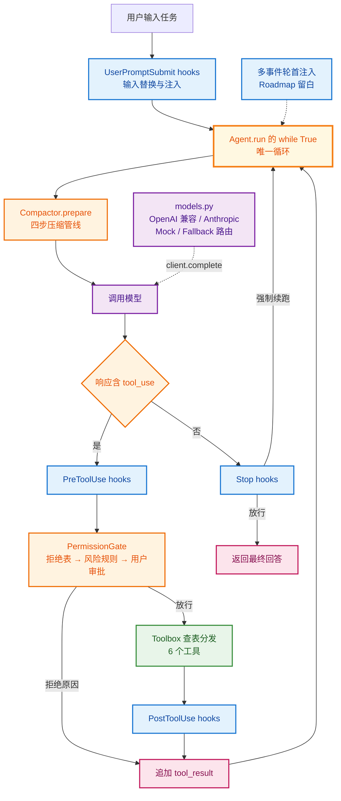
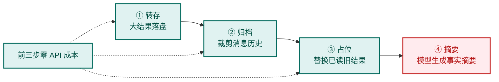

# LoopSmith — 手工锻造的最小 Coding Agent Harness

> *The loop is the agent; everything else is a hook.*

LoopSmith 是在深入研读
[shareAI-lab/learn-claude-code](https://github.com/shareAI-lab/learn-claude-code)
后，从零实现并扩展的最小 Coding Agent Harness。原课程采用
[MIT License](https://github.com/shareAI-lab/learn-claude-code/blob/main/LICENSE)；
本项目保留清晰的学习血统，不把课程概念包装成原创发明。

## 为什么造它

很多 Agent 框架把循环、工具协议、权限和上下文管理藏在 SDK 或层层抽象后面。
能调用框架，不等于知道 Claude Code 一类产品为什么这样组织。

LoopSmith 把范围压到一个单机、单会话 REPL：循环只有一个退出信号，其余能力都挂在
明确边界上。实现保持可读、可测试、可审计，适合逐行解释每个机制的职责。

## 架构



`Agent.run` 是唯一循环。加工具只改工具箱，加策略只注册 hook，加模型只改边界适配器。

## 机制速览

| 机制 | 课程章节 | 一句话 | 代码入口 |
|---|---|---|---|
| Agent Loop | s01 | 调模型、执行工具、回填结果，直到没有 `tool_use` | `loopsmith/agent.py` |
| 工具分发 | s02 | 6 个工具通过注册表查找，错误转成结果而不炸循环 | `loopsmith/tools.py` |
| 权限闸门 | s03 | 拒绝表、风险规则、用户审批依次执行 | `loopsmith/permission.py` |
| 四事件 Hooks | s04 | 输入、执行前、执行后、停止四个扩展点 | `loopsmith/hooks.py` |
| TodoWrite | s05 | 约束计划状态，连续 3 轮未更新时注入提醒 | `loopsmith/tools.py`、`loopsmith/agent.py` |
| 上下文压缩 | s08 | 先做零 API 成本处理，最后才调用模型摘要 | `loopsmith/compact.py` |
| 多模型路由 | 扩展 | 两类协议、多提供商、故障切换和 token 统计 | `loopsmith/models.py` |



固定顺序的关键是先转存、再占位：只有先把完整输出落盘，占位符才有可恢复的路径。

## 快速开始

需要 Python 3.10 及以上版本。

```bash
python3.11 -m venv .venv
source .venv/bin/activate
pip install -e ".[dev]"
cp .env.example .env
```

在 `.env` 中填写一个模型及对应 API key，然后运行单次任务：

```bash
python -m loopsmith "list the python files here"
```

不传参数进入保留会话历史的 REPL，输入 `q`、`quit` 或 `exit` 退出：

```bash
python -m loopsmith
```

备用模型可跨提供商，按顺序尝试：

```bash
LOOPSMITH_FALLBACK_MODELS=deepseek-chat,qwen-max
```

Ollama 等本地 OpenAI 兼容端点不要求真实 key：

```bash
LOOPSMITH_MODEL=llama3
LOOPSMITH_BASE_URL=http://localhost:11434/v1
LOOPSMITH_API_KEY=ollama
```

## 多模型路由

| 模型名前缀 | 提供商 | 默认 Base URL | API key 环境变量 |
|---|---|---|---|
| `glm`、`chatglm` | 智谱 GLM | `https://open.bigmodel.cn/api/paas/v4` | `GLM_API_KEY` 或 `ZHIPU_API_KEY` |
| `deepseek` | DeepSeek | `https://api.deepseek.com` | `DEEPSEEK_API_KEY` |
| `qwen`、`qwq` | 通义千问 | `https://dashscope.aliyuncs.com/compatible-mode/v1` | `DASHSCOPE_API_KEY` 或 `QWEN_API_KEY` |
| `moonshot`、`kimi` | Moonshot | `https://api.moonshot.cn/v1` | `MOONSHOT_API_KEY` |
| `claude` | Anthropic | `https://api.anthropic.com` | `ANTHROPIC_API_KEY` |
| `gpt-`、`o1`、`o3`、`o4` | OpenAI | `https://api.openai.com/v1` | `OPENAI_API_KEY` |

`LOOPSMITH_PROVIDER` 可显式选择提供商；`LOOPSMITH_BASE_URL` 和
`LOOPSMITH_API_KEY` 可覆盖端点与密钥。自定义端点默认按 OpenAI 兼容协议处理，
显式选择 `anthropic` 时仍使用 Anthropic 原生协议。

`FallbackClient` 只在当前客户端最终抛出 `ModelError` 后切换到下一个模型。
429、5xx、超时和传输错误会先在单客户端内指数退避重试 3 次，耗尽后才升级为
`ModelError`；成功切换记录在 `switched_to`，每轮 token 用量统一累计。

## 设计问答

### 为什么 `tool_result` 必须用 `tool_use_id` 配对？切历史时怎么保护？

一次回复可以包含多个工具调用，仅靠消息顺序不能可靠指明结果属于谁。
`tool_use_id` 是模型协议的关联键，OpenAI 线也会转换为 `tool_call_id`。
`_snip` 和 `reactive_compact` 在切点命中结果消息时会向前移动边界，避免制造孤儿结果。

### 压缩四步为什么是这个顺序？为什么转存必须发生在占位之前？

四步按信息损失和调用成本递增：转存、归档、占位都不调用 API，摘要最贵。
大结果先落盘后，上下文才能留下 `Full output` 路径。
如果先占位，完整内容可能在获得恢复地址前就丢失。

### 为什么权限检查做成 PreToolUse hook，而不是写在循环里？

权限是工具执行前的策略，不是 Agent Loop 的核心状态转移。
放进 hook 后，循环只识别“放行或返回拒绝结果”，权限实现可以独立替换。
日志、审计或更强沙箱也能挂在同一边界，而不继续膨胀循环。

### 为什么模型内部格式选 Anthropic 风格 blocks？

显式块能在一条消息中同时表达文本和多个 `tool_use`。
`tool_result` 也有独立类型和关联 ID，便于验证配对不变量。
它与课程模型一致，而 OpenAI 兼容格式只在适配器边界转换。

### 为什么拒绝列表只是字符串匹配？它的结构性意义是什么？

本版本的目标是展示确定性检查位于真实执行之前，而不是宣称字符串匹配足够安全。
拒绝表零成本且容易审计，但会有误报、漏报和 shell 绕过。
生产环境应替换为沙箱、系统调用过滤或结构化命令策略，闸门位置仍保持不变。

### FallbackClient 在什么错误下切换、什么错误下不切换？

它捕获所有 `ModelError`，包括不可重试 HTTP 错误和重试耗尽后的网络错误。
429、受支持的 5xx、超时和传输错误先由单客户端重试 3 次，不会立即切换。
普通编程异常、协议外异常和中断不被 FallbackClient 吞掉，因此不会静默换模型。

## 测试

```bash
.venv/bin/python -m pytest -q
# 52 passed
```

全部 52 项测试不访问网络；`MockClient` 用脚本回放覆盖循环、工具调用、Hooks、
权限、压缩、路由、故障切换和 token 统计。

## Roadmap

- s06 subagent：单独立项，不往本版本塞。
- s07 skills：单独立项，不往本版本塞。
- s09 memory：单独立项，不往本版本塞。
- s10 task graph：单独立项，不往本版本塞。
- s13 teams：单独立项，不往本版本塞。
- s14 MCP：单独立项，不往本版本塞。
- s17 goal loop：单独立项，不往本版本塞。

## License 与致谢

LoopSmith 采用 [MIT License](LICENSE)。

感谢 [learn-claude-code](https://github.com/shareAI-lab/learn-claude-code)
对 Claude Code 式 Harness 机制的系统拆解，以及 Claude Code 提供的产品概念参照。
