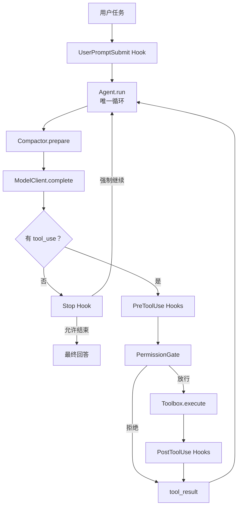

<div align="center">

# AgentLoop

**面向本地开发任务的 Coding Agent**

`Python 3.10+` · `OpenAI / Anthropic` · `offline test suite` · `MIT`

集成上下文工程、会话记忆、权限管理和工具执行，支持命令行、Web 与 macOS 桌面使用。

[整体模块](#核心能力) · [状态与存储](#状态与存储) · [关键链路](#关键链路只读日志分析) ·
[方案与验证](#方案选择与验证) · [快速开始](#快速开始) · [实现手册](docs/study-guide.md)

</div>

---

AgentLoop 是我开发的本地 Coding Agent，围绕“理解任务、调用工具、读取结果、继续执行”
构建完整执行流程。它可以读取和修改项目文件、运行命令、维护任务计划，并通过多轮
模型与工具交互完成开发任务。

## 核心能力

- **上下文工程**：按完整请求预算管理系统提示、工具定义和消息；分级压缩、可回读归档与增量摘要控制长任务上下文。
- **会话记忆**：用短期上下文承接多轮任务，用持久化会话和历史归档长期保存执行记录，支持恢复已有会话。
- **权限管理**：在工具执行前统一检查权限，对禁止操作直接拒绝，对风险命令请求人工审批。
- **工具系统**：统一注册和分发文件读写、内容编辑、文件查找、Shell 执行与任务计划工具，将执行结果和错误回填给模型。
- **模型接入与容错**：支持 OpenAI 兼容协议和 Anthropic 原生协议，提供失败重试、多模型切换与离线回放。
- **交互与任务控制**：提供 CLI、Web 和 macOS 桌面入口，支持流式输出、多会话管理、工具过程展示与任务取消。

### 上下文工程

实现“大结果落盘 → 旧结果引用 → 统一 checkpoint → 增量摘要”的分级管线。
预算覆盖系统提示、工具定义与消息；超大最新工具结果同样会先落盘，保留首尾和错误相关采样及原文路径。压缩过程中保护工具调用与工具结果的配对关系；本地预算仍无法满足时明确报错停止，模型报告超限时可再做一次补救压缩。

### 短期记忆与长期保存

短期记忆由当前会话的消息历史、工具结果和压缩摘要组成，让 Agent 在连续交互中
承接已有任务。Web 会话按工作区持久化，重新打开后可以恢复；大段工具输出和历史
记录另行落盘，保留后续查阅依据。

当前的长期保存以会话恢复和文件归档为基础，尚未实现跨会话知识提取、语义检索与自动召回。

上下文压缩按 `source_id` 有序保存用户原文；旧工具结果先保存原文再替换为路径，摘要失败或截断时把待处理历史保留为可重放归档。方案比较、字段设计和离线实验见
[上下文工程：从选型到验证](docs/context-design.md)。

### 权限管理与工具系统

工具执行经过统一权限入口，结合硬拒绝规则、风险识别和人工审批控制操作。
文件工具限制工作区路径，Shell 工具支持超时、输出截断和取消；任务停止时终止正在
执行的 Shell 子进程组。工具执行失败会作为结果反馈给模型，供后续调整执行步骤。

工具注册表与 Agent 主循环分离；输入、工具执行前后和任务停止四类 Hook 提供扩展点，
便于接入输入处理、权限策略和执行记录。当前权限规则基于模式匹配，不提供生产级 Shell 沙箱隔离。

## 架构



这里的 ReAct 循环是“模型选择行动 → 工具执行 → 观察结果 → 再次决定”。
`Agent.run` 维护同一份消息历史；增加工具改工具箱，增加执行策略注册 Hook，接入模型改协议适配。

## 状态与存储

对话需要保留顺序，工具需要按名称查找，所以我分别使用 List 和 Map。运行状态分布在
`Agent`、`Compactor`、工具箱和会话存储中，没有把它们合成一个统一的 `AgentState`。

| 状态 | 数据结构 | 保存什么、存在哪里 |
|---|---|---|
| `messages` | `list[dict]` | 内存中的有序对话；`role` 表示角色，`content` 保存文本或消息块。Web 会话会将它持久化为 JSON |
| 工具调用与结果 | 消息内的 `list[dict]` | 调用含 `type / id / name / input`；结果含 `type / tool_use_id / content`，通过 ID 配对 |
| 请求来源 | 消息上的字符串字段 | `_request_id` 标识本次输入，`_request_text` 保存入口原文；发给提供商前移除这些内部字段 |
| 工具注册表 | `dict[str, ToolDef]` | 内存中按名称查找工具描述、参数 schema 和 handler；handler 不序列化到会话 |
| 计划与循环进度 | List、整数、Dict | 运行期状态：`TodoManager.items` 保存 `content / status`；`turns / reactive_retries / todo_gap` 记录轮数、补救次数与提醒间隔，`usage` 记录主循环用量 |
| `user_requests` | `list[dict]` | 检查点中的用户原文记录，每项为 `source_id + text`；有序保留早期要求和后续修改 |
| `current_request / summary` | `str` | 当前用户原文与模型生成的历史摘要；都直接放进检查点文本 |
| `transcript / pending_transcripts` | `str / list[str]` | 压缩前消息快照路径、尚未完成摘要的历史路径；原文保存在 `.transcripts/*.json` |
| 大工具结果 | 文本文件与路径引用 | 原文保存在 `.task_outputs/tool-results/<SHA-256>.txt`，消息改为采样片段或文件引用 |
| 检查点版本与状态 | 整数、字符串 | `schema_version / revision / summarized_messages / mode / summary_error` 记录格式版本、摘要进度和失败类型 |

`CompactionState` 是 dataclass，经 `asdict()` 转为 JSON 文本，放在一条带 `[Compacted]`
标记的消息里；它仍属于 `messages`。`CompactionReport` 另行记录最近一次压缩的前后字符数、
摘要调用与用量、预算估算值和是否降级，便于诊断。

计划对象、循环计数与压缩诊断对象不会随 Web 会话恢复；主循环用量可从 `RunResult` 或事件读取。

短期记忆就是当前消息、摘要和执行进度。长期保存包括工具原文、历史归档与 Web 会话 JSON：
默认会话文件位于 `~/.agentloop/sessions/<workspace-hash>.json`，会话条目保存
`id / title / created_at / updated_at / messages / events`。恢复消息不等于恢复执行中的程序栈，
也不等于跨会话知识提取或语义检索。

代码入口：[循环状态](agentloop/agent.py) · [压缩状态](agentloop/compact.py) ·
[工具与计划](agentloop/tools.py) · [Web 会话存储](agentloop/web.py)

## 关键链路：只读日志分析

以用户输入“只检查日志原因，不修改文件”为例，沿同一个 ReAct 循环看状态怎样变化。
下面的 ID、路径和摘要是讲解示例；可重复运行的验证见下一节。

### 1. 接收请求，进入模型与工具循环

`Agent.run()` 保存入口原文，执行 `UserPromptSubmit` Hook，再向 `messages` 追加用户消息。
每轮调用模型前都运行 `prepare(messages, current_request=..., system_prompt=..., tools=...)`。
模型返回 `tool_use` 时，程序经过 `PreToolUse` 权限检查，按工具名分发执行，再将结果作为
`tool_result` 追加到历史，回到下一轮 `prepare()`。

例如，模型请求 `bash(command="cat service.log")`，调用 ID 为 `t1`。执行结果通过
`tool_use_id="t1"` 关联回该调用。权限拒绝也会生成结果，让模型看到拒绝原因并调整后续动作。

这里的“只读”原文会被保留并传给模型；默认权限规则检查 Shell 禁止模式和风险关键词，
尚未把自然语言要求编译成所有写工具的强制禁用策略。

### 2. 大结果先落盘，预算满足就继续

假设该工具返回 120,000 字符日志。下一轮 `prepare()` 发现消息超过默认的 50,000 字符限制，
即使最新批次尚未超过 200,000 字符，也会转存大结果。**工具调用 ID 和结果关联保持不变，
改变的是结果的 `content`。**

```text
处理前
assistant: tool_use(id=t1, name=bash, input={command: "cat service.log"})
user:      tool_result(tool_use_id=t1, content="120,000 字符日志……")

处理后
assistant: tool_use(id=t1, name=bash, input={command: "cat service.log"})
user:      tool_result(tool_use_id=t1, content="首部、错误片段、尾部……
           Full output: .task_outputs/tool-results/<hash>.txt")
```

完整预算还包括 `system + tools + messages`。默认应用窗口为 64,000，减去 8,000 输出预留和
2,000 安全余量，输入目标是 54,000 个估算单位；默认用 UTF-8 字节数保守估算，可替换计数器。
这是应用预算，未自动探测提供商真实窗口，也不是精确 tokenizer。

若落盘和旧结果占位后，两项预算都满足且消息不超过 50 条，就直接把新列表交给模型，
**这一阶段无需调用摘要模型，也不会创建新的摘要检查点。**

### 3. 历史继续增长时，才生成增量检查点

后续多轮执行使消息超过 50 条，或者仍不能满足预算时，`_compact()` 归档当前消息快照，
通常保留最近五条消息，并在切点处保护完整工具调用组。较早历史和此前待处理归档作为新增输入，
与 `previous_summary` 一起交给摘要模型。

```text
压缩前 messages
[旧检查点（如有）, 新增历史, 近期工具调用与结果]

压缩后 messages
[user: "[Compacted]\n{用户原文记录、摘要、归档路径、待处理路径、版本等}",
 近期工具调用与结果]
```

摘要输入中的工具结果采用首尾和错误片段采样，调用信息保留名称与参数片段。
摘要预算按时间顺序容纳完整消息组；待摘要批次中尚未发送的历史会归档，`pending_transcripts`
保存这些路径，后续再次触发摘要时重放。近期消息仍保留在 `messages`，最终预算检查也可进一步归档它们。

假设用户随后输入“继续”，在下一次压缩后，用户原文记录包含两条要求：

```json
[
  {"source_id": "request-1", "text": "只检查日志原因，不修改文件"},
  {"source_id": "request-2", "text": "继续"}
]
```

这些原文由程序维护，摘要不能改写它们。输入 Hook 的改写不覆盖入口原文，Stop Hook 注入的
内部续跑消息也不会成为用户要求。程序尚未自动提取、合并生效约束，后续明确修改由模型结合原文理解。

### 4. 回读与失败后怎样接回执行

`prepare()` 返回的列表会重新赋给当前循环的 `messages`，随后发送同一个系统提示和工具定义。
模型需要旧日志细节时，调用 `search_file(path, query)` 定位行号，再调用
`read_file(path=..., offset=..., limit=...)` 分页读取；回读结果仍经 `tool_result` 进入下一轮循环。

| 情况 | 状态怎样处理 | 后续执行 |
|---|---|---|
| 摘要失败、为空、过长或被提供商标记为截断 | 不提交该摘要；优先保留上次有效摘要，新增历史写入待处理归档 | 最终预算满足时继续；以后再次摘要时重放待处理历史 |
| 提供商报告上下文超限 | `reactive_compact()` 降低目标预算，重新归档与压缩 | 返回同一个循环，默认每次 `run` 最多补救一次 |
| 用户原文或固定请求内容仍使最终预算超限 | 抛出 `ContextBudgetError` | 明确结束本次运行，不靠静默删除用户要求解决 |
| 归档写入失败、程序错误或取消 | 向上传播错误或取消信号 | 不把失败伪装成已成功保存 |

回读是模型显式发起的工具调用，当前没有自动语义召回器。文件工具有工作区和输出范围限制；
Shell 工具在 200,000 字符处已截掉的原始输出，无法再由压缩器恢复。

沿代码讲解：[Agent._run](agentloop/agent.py) → [Compactor.prepare / _compact](agentloop/compact.py)
→ [RequestBudget](agentloop/budget.py) → [Toolbox.execute](agentloop/tools.py)。

## 方案选择与验证

我的选择依据是：开发任务中的日志与文件需要可回读，用户要求需要跨多轮保留，摘要服务失败后
也要有明确的恢复路径。因此采用**程序归档与采样，加增量摘要**。

| 方案 | 优点 | 代价与取舍 |
|---|---|---|
| 程序截断或滑动窗口 | 简单、确定，无摘要调用 | 可能直接丢掉早期约束和证据；只作为局部减量策略 |
| 结构化提取 | 目标、决定、约束等字段便于查询 | 需处理遗漏、来源、冲突和过期；当前采用程序状态字段，未实现完整语义知识提取 |
| 单独模型摘要 | 能概括复杂语义 | 依赖模型质量和可用性，具体证据与用户要求可能遗漏 |
| 本项目的组合方案 | 大结果可直接落盘，原文可回读，摘要失败可重放 | 增加磁盘 I/O 和回读调用；摘要仍是有损概括 |

我验证的是这些机制是否按预期工作。以下离线回放使用相同输入和固定摘要，比较修复前提交
`5154aa2` 与实现提交 `87316f6`；没有将框架举例当成已核验的横向效果排名。

| 场景 | 修复前 | 当前实现 |
|---|---|---|
| 最新工具输出 120,000 字符 | 处理后消息仍有 120,458 字符，摘要调用 1 次 | 1,577 字符，摘要调用 0 次，尾部错误可见、落盘原文回读一致 |
| 摘要输入保留日志中部错误和尾部标记 | 两者均遗漏 | 两者均包含 |
| “只读”后输入“继续”，连续两次固定摘要都漏掉约束 | 压缩上下文丢失先前只读要求 | 用户原文记录仍保留要求 |
| 第二次增量摘要失败 | 无待处理历史重放字段 | 旧摘要保留，待处理历史在第三次摘要调用中重放 |

实现提交 `87316f6` 的完整验证为 **144 项测试通过，Ruff 检查通过**。上述数字衡量消息 JSON
字符数和控制流程，不能直接换算成 Token 费用、真实任务成功率或模型语义正确率。
真实模型下的跨方案质量、总调用成本和端到端耗时还需要单独测评。

复现入口：[回放脚本](scripts/benchmark_context_policy.py) ·
[原始结果](docs/evidence/context-policy-replay.json) ·
[行为测试](tests/test_context_policy.py) · [完整设计说明](docs/context-design.md)

## 快速开始

### 1. 安装

需要 Python 3.10 或更高版本。

```bash
git clone https://github.com/still0123/agentloop.git
cd agentloop
python3.11 -m venv .venv
source .venv/bin/activate
python -m pip install -e ".[dev]"
cp .env.example .env
```

### 2. 配置模型

编辑 `.env`，至少配置一个模型。以 DeepSeek 为例：

```dotenv
AGENTLOOP_MODEL=deepseek-chat
DEEPSEEK_API_KEY=sk-...
```

也可以连接本地 Ollama 或其他 OpenAI 兼容端点：

```dotenv
AGENTLOOP_MODEL=llama3
AGENTLOOP_BASE_URL=http://localhost:11434/v1
AGENTLOOP_API_KEY=ollama
```

### 3. 运行

单次任务：

```bash
python -m agentloop "列出当前目录中的 Python 文件"
```

连续会话：

```bash
python -m agentloop
```

本地 Web UI：

```bash
agentloop web
```

Web 会话按工作区自动保存，支持创建、切换、改名和删除，模型文本按 Token
增量显示。运行中可点击“停止”取消任务；正在执行的 `bash` 命令会终止整个
子进程组。

## Web UI

| 工具执行与流式回答 | 危险命令权限审批 |
|---|---|
|  |  |

### 4. macOS 桌面应用

桌面版使用 pywebview 将同一套本地 Web UI 放入原生窗口，不引入 Electron 或
额外服务框架。先准备桌面配置：

```bash
mkdir -p ~/.agentloop
cp .env.example ~/.agentloop/.env
# 编辑 ~/.agentloop/.env；可选设置 AGENTLOOP_WORKDIR=/path/to/project
```

安装构建依赖并生成应用：

```bash
python -m pip install -e ".[dev,desktop]"
make macos-app
open dist/AgentLoop.app
```

生成可安装的 PKG 和拖拽安装的 DMG：

```bash
make macos-package
ls dist/installers/
```

应用默认使用 `~/.agentloop/workspace`；也可以通过 `AGENTLOOP_WORKDIR` 指向可信项目。
当前产物使用本机临时签名，适合自用；公开分发前仍需 Developer ID 签名和公证。

不配置模型也能运行全部离线测试：

```bash
make check
```

## 已实现能力

| 能力 | 实现 | 代码入口 |
|---|---|---|
| Agent Loop | 以“无 `tool_use`”为自然退出信号，带最大轮数保护 | [`agent.py`](agentloop/agent.py) |
| 工具系统 | 7 个工具，注册表分发，错误回填给模型 | [`tools.py`](agentloop/tools.py) |
| 权限闸门 | 硬拒绝、风险识别、人工审批 | [`permission.py`](agentloop/permission.py) |
| 生命周期 Hooks | 输入、执行前、执行后、停止四个事件 | [`hooks.py`](agentloop/hooks.py) |
| 计划约束 | `todo_write` 状态校验和三轮提醒 | [`tools.py`](agentloop/tools.py) |
| 上下文压缩 | 完整请求预算、原文归档、增量摘要与失败重放 | [`compact.py`](agentloop/compact.py) |
| 模型路由 | OpenAI 兼容协议、Anthropic 原生协议、Mock、Fallback | [`models.py`](agentloop/models.py) |
| CLI | 单次任务、保留历史的 REPL、token 统计 | [`cli.py`](agentloop/cli.py) |
| Web UI | Token 流式、断线重放、权限审批、多会话、任务取消 | [`web.py`](agentloop/web.py) |
| macOS 桌面壳 | 原生窗口、复用 Web UI、关闭时停止服务和任务 | [`desktop.py`](agentloop/desktop.py) |

### 内置工具

| 工具 | 用途 | 保护措施 |
|---|---|---|
| `bash` | 执行 shell 命令 | 超时、取消、输出截断、权限 Hook |
| `read_file` | 按 1-based 行号分页读取文本 | 工作区路径限制、页大小上限、下一页提示 |
| `search_file` | 字面搜索归档或日志 | 工作区路径限制、行号与有界上下文 |
| `write_file` | 创建或覆盖文件 | 工作区路径限制 |
| `edit_file` | 精确替换首个匹配 | 工作区路径限制 |
| `glob` | 查找文件 | 数量上限 |
| `todo_write` | 更新会话计划 | 数量和状态校验 |

## 模型配置

| 模型名前缀 | 提供商 | API Key 环境变量 |
|---|---|---|
| `glm`、`chatglm` | 智谱 GLM | `GLM_API_KEY` 或 `ZHIPU_API_KEY` |
| `deepseek` | DeepSeek | `DEEPSEEK_API_KEY` |
| `qwen`、`qwq` | 通义千问 | `DASHSCOPE_API_KEY` 或 `QWEN_API_KEY` |
| `moonshot`、`kimi` | Moonshot | `MOONSHOT_API_KEY` |
| `claude` | Anthropic | `ANTHROPIC_API_KEY` |
| `gpt-`、`o1`、`o3`、`o4` | OpenAI | `OPENAI_API_KEY` |

可选配置：

```dotenv
# 显式指定提供商
AGENTLOOP_PROVIDER=anthropic

# 覆盖默认端点与密钥
AGENTLOOP_BASE_URL=https://example.com/v1
AGENTLOOP_API_KEY=...

# 主模型失败后按顺序切换
AGENTLOOP_FALLBACK_MODELS=deepseek-chat,qwen-max

# 单次回复 token 上限
AGENTLOOP_MAX_TOKENS=8000

# 完整请求的上下文窗口与安全余量；默认 64000 / 8000 / 2000。
# 默认估算是保守 UTF-8 字节数，不是提供商精确 token 计数。
AGENTLOOP_CONTEXT_TOKENS=64000
AGENTLOOP_CONTEXT_MARGIN=2000
```

单个客户端会先对 429、部分 5xx、超时和传输错误做指数退避；重试耗尽并转成
`ModelError` 后，`FallbackClient` 才会切换到下一个模型。

## 实现详解

完整技术文档位于 **[`docs/study-guide.md`](docs/study-guide.md)**，包含：

1. 一条请求从 CLI 到最终回答的完整时序；
2. `tool_use` / `tool_result` 内部消息协议；
3. `Agent.run` 核心循环逐段解析；
4. 工具注册、异常回填和工作区路径保护；
5. Hook 短路规则与三道权限闸门；
6. 完整请求预算、增量检查点、原文回读和消息配对保护；
7. OpenAI / Anthropic 协议适配、重试与 Fallback；
8. 测试证据、扩展练习和生产化边界。

推荐第一次按下面顺序读：

```text
test_tool_roundtrip
  -> Agent.run
  -> MockClient
  -> Toolbox
  -> HookRegistry
  -> PermissionGate
  -> Compactor
  -> build_client
```

## 开发与测试

```bash
# 安装开发依赖
make install

# 自动修复 lint，并统一格式
make format

# 只检查，不改文件
make lint

# 运行测试
make test

# 提交前完整检查
make check

# 构建 macOS 应用和安装包
make macos-app
make macos-package
```

CI 使用 Python 3.10–3.13 矩阵执行同样的 Ruff 和 Pytest 检查。格式与静态规则
统一定义在 `pyproject.toml`，编辑器基础行为定义在 `.editorconfig`。

测试全部离线运行，具体数量以 `pytest -q` 输出为准。

## 项目边界

当前版本有意不包含：

- 生产级 shell 沙箱；
- Subagent、MCP、Skills、跨会话长期记忆检索与自动召回、任务图；
- 多用户服务端数据库和远程访问；
- 多工具并发执行。

这些能力不应直接塞进核心循环。合适的扩展位置分别是工具层、Hook、上下文层或模型
适配层。具体风险与演进方向见
[实现手册的生产化章节](docs/study-guide.md#14-边界风险与生产化方向)。

## License

[MIT](LICENSE) © 2026 AgentLoop contributors
