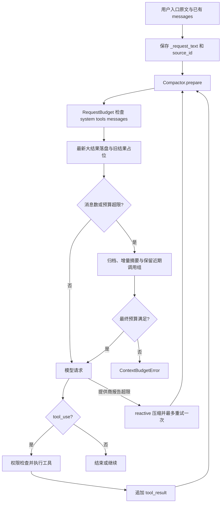

# AgentLoop 上下文工程：从请求预算到可回读检查点

我开发的 AgentLoop 包含 Agent Loop、上下文与会话管理、权限与工具系统、模型适配和 CLI/Web/桌面入口。这份说明沿上下文管理这条关键链路，解释方案选择、状态存储、执行流程及验证结果。

## 1. 问题与选择

一次 Agent 请求包含系统提示、工具定义和按顺序排列的消息。长任务中，日志、文件和工具结果会持续增加；简单滑动窗口成本低，却会丢掉早期证据和用户要求；纯模型摘要能保留语义，却有额外调用、遗漏和失败风险；结构化提取便于维护目标与待办，但还需要来源、冲突与更新规则。

当前选择是分级混合方案：程序先转存和缩小内容，必要时才增量摘要；压缩记录留下用户原文、摘要和归档引用。它优先保证“可继续执行、可定向回读”，而不是声称已经解决主动召回或语义状态合并。

| 候选方案 | 优点 | 主要代价或风险 | 取舍 |
|---|---|---|---|
| 只保留近期消息 | 确定、简单，无摘要调用 | 早期要求和证据可能被直接删除 | 用于保留近期调用组，不能单独承担上下文管理 |
| 结构化提取 | 目标、约束、决定与待办可按字段查询 | 需要事实来源、冲突更新与过期规则，JSON 合法不代表事实正确 | 当前只采用程序维护的状态字段，尚未做完整语义提取 |
| 只做模型摘要 | 能概括复杂语义 | 额外模型调用，且存在遗漏、截断和服务故障 | 作为历史概括环节 |
| 分级压缩、归档与增量摘要 | 大结果可不调用摘要模型；原文可回读；故障可重放 | 增加磁盘 I/O 和回读调用，语义质量仍受摘要模型影响 | 当前采用 |

这些方案可以组合。选型依据是 Coding Agent 的日志与文件证据需要可回读，以及失败后需要保住用户要求。它不是跨框架真实模型跑分的排名。设计概念可参见 [LangChain 记忆说明](https://docs.langchain.com/oss/python/concepts/memory) 与 [Anthropic 上下文工程说明](https://www.anthropic.com/engineering/effective-context-engineering-for-ai-agents)，不能把任何框架概括成只有一种压缩方案。

## 2. 请求预算

`RequestBudget` 计算**完整模型请求**：`system + tools + messages` 的 JSON payload 和协议包装开销，而不是只数消息文本。默认使用 UTF-8 字节数作为保守估计；这不是任何模型的精确 tokenizer。部署方可传入与实际模型匹配的 `token_estimator`。

CLI 默认应用预算为：窗口 `64,000`、输出预留 `8,000`、安全余量 `2,000`，所以输入目标为 `54,000` 个估算单位；这不代表程序探测到了提供商的真实窗口。通过 `.env` 的 `AGENTLOOP_CONTEXT_TOKENS`、`AGENTLOOP_MAX_TOKENS` 与 `AGENTLOOP_CONTEXT_MARGIN` 调整。另保留消息 JSON `50,000` 字符的限制，两者都要满足。

压缩后仍无法放进这个预算时，程序抛出 `ContextBudgetError`，明确停止本次请求；不会偷偷删除受保护的用户原文来“凑合发送”。提供商报告超限时，主循环可走一次 reactive compaction；它是对本地估算偏差的补救，不是预算器精确的证明。

## 3. 状态如何保存

运行态的 `messages` 是 `list[dict]`，因为对话顺序与 `tool_use` / `tool_result` 的配对都依赖顺序。工具注册表是 `dict[str, ToolDef]`，按名称查询。压缩检查点是 JSON 文本，放在带 `[Compacted]` 或 `[Reactive compact]` 标记的一条消息中。

消息保存 `role` 和 `content`，后者是文本或块列表。调用块含 `type / id / name / input`，结果块含 `type / tool_use_id / content`。循环另有 `turns / reactive_retries / todo_gap / usage`；计划是 `TodoManager.items: list[dict]`。Web 持久化会话保存 `id / title / created_at / updated_at / messages / events`，用于恢复消息，不是执行中程序栈的快照。

| 字段 | 保存内容 |
|---|---|
| `schema_version` | 当前检查点格式版本 `2` |
| `current_request` | 当前请求原文，便于兼容读取 |
| `user_requests` | 有序 ledger；每项含原文 `text` 与稳定 `source_id` |
| `summary` | 上一个有效摘要加新增历史得到的增量摘要文本 |
| `transcript` | 此次压缩前完整消息快照的相对路径 |
| `pending_transcripts` | 摘要失败或摘要无法容纳时，等待下一次摘要重放的归档路径 |
| `revision` / `summarized_messages` | 检查点演进诊断信息 |
| `mode` / `summary_error` | 正常摘要或降级状态及错误类型 |

`CompactionReport` 单独记录最近一次处理的 `before_chars / after_chars / summary_calls / summary_input_tokens / summary_output_tokens / fallback / estimated_input_tokens / input_limit_tokens / budget_satisfied`。其中摘要 Token 来自提供商响应，预算值是本地估算，两者不能混作完整会话费用。

`user_requests` 由程序在入口保存的原始用户文本 `_request_text` 和 `_request_id` 维护；即使输入 Hook 改写了送给模型的文本，ledger 仍保留入口原文。Stop Hook 为强制续跑注入的文本标记为 `_origin=internal`，不会被记成用户要求。旧会话中没有请求 ID 的用户消息只会在首次 checkpoint 时迁移，并标记 `origin=legacy`，后续 checkpoint 不重复迁移。摘要不能改写 ledger；后续请求按出现顺序解释，只有用户明确更新才改变前一条要求的适用性。当前没有实现把自然语言自动合并成 `active_constraints` 的语义层。

归档与工具原文只追加保存到工作区的 `.transcripts/`、`.task_outputs/`；本机制不会自动删除它们。工具结果以内容哈希命名，避免重复调用 ID 覆盖不同证据。

## 4. 一条请求怎样流转

`prepare()` 每次模型调用前执行。它先检查最新一批工具结果：只要该批或完整请求超过预算，超大结果就先落盘，而不是因为它是“最新结果”就无限保留。落盘引用保留首尾片段，并优先包含错误相关片段；完整原文仍在路径中。

已被模型消费的较旧结果会转为引用。消息数量超限或完整请求不满足预算时，不再经过旧的 `_snip` 分支，而是进入统一 checkpoint：归档完整历史、保留近期调用组，并把其余历史交给摘要或降级记录。切点避免拆开 `tool_use` 与相邻 `tool_result`。

默认最新批次预算为 `200,000` 字符，完整请求超预算时也触发落盘；预览最多 `2,000` 字符。占位保留最新批次和最近三个已读结果；消息超过 `50` 条也会触发 checkpoint，摘要通常保留最近五条消息并修正工具配对边界。最终预算检查可以进一步归档这些近期消息。

摘要采用增量模式：`previous_summary + new_history` 生成新摘要。摘要输入按时间顺序选择能够放进摘要预算的完整消息组；一个 `tool_use` 与紧随的 `tool_result` 作为同一组，组内使用首尾与错误片段采样。待摘要批次中没有发给模型的完整消息不会被标为已摘要，而是归档并将路径写入 `pending_transcripts`；再次触发摘要时，按预算将这些历史与新历史一起处理。摘要失败、为空、过长，或模型返回的结束原因表明摘要不完整时，都走同一降级与待重放路径，不把不完整文本伪装成有效检查点。

## 5. 如何回读证据

压缩消息只放轻量路径，不把整段日志重新塞进上下文。模型需要细节时可以：

- 调用 `search_file(path, query, context, max_matches)` 做字面搜索，返回行号和有界上下文；它分块扫描，支持关键词跨读取块，适合超长日志行尾的错误。
- 调用 `read_file(path=..., offset=..., limit=...)` 按 1-based 行号分页读取；分页模式在仍有后续行时给出下一页 offset。

两个工具都限制在工作区内，且对搜索结果、单行、源扫描量和读取页大小设上界。回读是显式工具调用：当前没有“模型遗漏信息后自动判断并检索最相关归档”的自动召回器。

`read_file` 默认最多 200 行、约 50,000 字符；单行过长会提示改用搜索。`search_file` 默认 20 个匹配和前后两行，最多扫描约 10 MB 原文；扫描未完成会明确标记。Shell 工具自身在 200,000 字符处截断的更早原始输出仍无法由压缩器恢复。

## 6. 失败边界

- 摘要客户端不可用、返回空结果、超预算或结束原因表明摘要不完整：保留最后一个有效摘要（如有）、用户 ledger、近期消息和待重放归档，继续后续循环。
- 本地预算仍无法满足：抛出 `ContextBudgetError`，由调用方明确报告，不能以删除用户记录作为兜底。
- 磁盘归档失败或程序错误：向上抛出；不能报告“已保存”。
- 模型取消：继续传播取消，不转换为普通摘要失败。

## 7. 评估记录

### 第一轮历史离线结果（16e0a07 → 5154aa2）

以下数据来自此前的固定输入、固定离线摘要回放，比较旧提交 `16e0a07` 与 `5154aa2`。指标是消息 JSON 的字符数，不是 Token、模型费用、端到端延迟或真实任务成功率。

| 场景 | 结果 |
|---|---|
| 14 组工具结果，原始 142,960 字符 | 旧版 43,150（减少 69.82%）；当时新版 44,110（减少 69.15%），并保留早期证据回读路径 |
| 固定摘要遗漏“只检查、不写入” | 当时新版通过程序保留当前请求避免仅依赖该摘要 |
| 摘要服务故障 | 当时新版生成 fallback 上下文，测试覆盖继续进入循环 |

这些历史结果只说明早期机制在离线输入上的行为，不能代表本轮 RequestBudget、增量摘要、定向回读或截断降级的测评结论。

### 本轮离线回放（5154aa2 → 当前修复）

运行 `.venv/bin/python scripts/benchmark_context_policy.py`，脚本从 Git 提取修复前实现，用同一组输入和固定摘要比较。原始记录见 [context-policy-replay.json](evidence/context-policy-replay.json)。

| 场景 | 修复前 | 本轮修复 |
|---|---|---|
| 最新工具输出严格 120,000 字符 | 处理后消息 120,458 字符，仍超 50,000；调用摘要一次 | 1,577 字符，无摘要调用，错误尾部可见，原文逐字回读一致 |
| 工具日志中部错误与结尾标记 | 两者未进入摘要输入 | 两者均进入摘要输入 |
| “只读”之后“继续”，连续两次摘要都遗漏要求 | 压缩上下文丢失先前只读要求 | 用户原文记录保留只读要求 |
| 增量摘要第二次失败 | 无待处理历史重放字段 | 保留旧摘要，待处理归档在第三次调用重放并清空 |

第一项消息字符量由修复前处理结果降至 1,577，减少约 98.69%。这只验证固定输入下的压缩、保留和重放机制，不代表真实模型的语义正确率或同等幅度的费用下降。完整回归测试另覆盖模型结束原因、中文预算、未进入摘要的消息重放、内部消息隔离和回读边界。

本轮验证：Python 3.11 下 `.venv/bin/python -m pytest -q` 为 **144 passed**；`.venv/bin/ruff check .`、`.venv/bin/ruff format --check .` 和 `git diff --check` 均通过。测试直接运行 pytest，模型调用使用离线响应；完整套件中的本机 HTTP/SSE 协议测试在允许回环端口的环境运行。

沿代码查看：[请求预算](../agentloop/budget.py)、[压缩与重放](../agentloop/compact.py)、[循环接入](../agentloop/agent.py)、[定向回读](../agentloop/tools.py)、[行为回归](../tests/test_context_policy.py)。

### 真实模型测评仍需补充

待补充同一模型、同一任务、同一输入预算下的：完整请求估算值与实际提供商用量、任务完成率、约束遗漏率、归档回读成功率、摘要与回读总成本、端到端耗时。补齐前不宣称本轮优于单独窗口、截断、纯摘要或结构化提取方案。

## 8. 讲解时可以这样总结

> 我把上下文当成一次完整模型请求来管理，而不是只压缩聊天文本。默认用保守 UTF-8 估算，完整请求超预算会明确停止。压缩记录把入口用户原文按 source_id 有序保存，摘要只负责历史概括，不能覆盖用户要求。大日志先落盘并保留可定位的首尾和错误采样；需要细节时通过搜索和分页读取回读。摘要只处理预算能容纳的完整消息组，其余历史进入待重放归档；摘要失败或被结束原因标记为不完整时，也不会把该文本当成最终状态。
