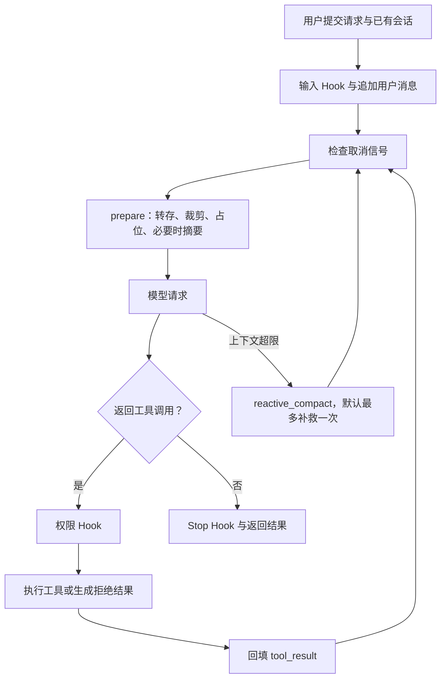

# AgentLoop 上下文工程：从方案选择到代码验证

这份材料采用项目作者的第一人称，便于讲解。本轮实际进行了资料核验、旧版代码分析、实现修改、离线回放和测试；以下阶段是设计过程的组织方式，不代表此前已做过未记录的实验。

## 1. 我先界定要解决的问题

我开发的是一个本地 Coding Agent。整体有 Agent Loop、上下文与会话管理、权限与工具系统、模型适配以及 CLI/Web/桌面交互五部分。

核心执行过程是：用户提交任务，模型决定调用工具，程序检查权限并执行，再把工具结果回填给模型，进入下一轮。短期状态主要在有序的 messages 列表里；Web 会话可以持久化恢复。当前长期保存包括会话 JSON、工具结果文本和历史归档，没有跨会话语义知识库。

我重点解决长任务中的三个问题：

1. 大段日志和文件内容反复进入模型请求，增加上下文体积。
2. 直接删除旧信息之后，模型需要原始证据时找不回来。
3. 用户中途修改目标，或者摘要服务失败，后续循环可能丢失最新要求或直接退出。

因此我的验收目标不只是“压得更小”：我还要保留本次用户请求、保证工具调用与结果配对、让被省略的工具原文有回读路径，并验证压缩后能继续执行。

## 2. 我做了哪些资料调研

我查阅了两类官方说明，提取可用于本项目的设计思路，而没有把某一个框架概括成唯一方案。

- LangChain 的 Memory overview 区分线程范围的短期状态与跨会话长期记忆，也介绍 JSON profile 和文档集合两种记忆组织方式。这说明“结构化提取”是可选的记忆组织方式，并非 LangGraph 的全部实现。[官方说明](https://docs.langchain.com/oss/python/concepts/memory)
- Anthropic 的上下文工程文章讨论压缩、结构化笔记以及通过路径按需读取信息。我关注其中“在上下文保留轻量引用、需要时用工具加载”的思路。[官方说明](https://www.anthropic.com/engineering/effective-context-engineering-for-ai-agents)

这些文档说明方案存在及其设计考虑，不能证明我的实现更快、更省钱或者优于对应产品。后面的性能数字只来自本仓库的离线回放。

## 3. 我怎样比较方案

比较维度分成：输入规模、额外模型成本、关键事实保留、原始证据恢复、失败处理、实现复杂度。

| 候选 | 具体做法 | 优点 | 主要不足 | 我的决定 |
|---|---|---|---|---|
| A. 只保留近期消息 | 按条数或长度删除旧历史 | 简单、确定、没有摘要调用 | 早期约束和证据可能消失 | 作为局部策略，不单独采用 |
| B. 结构化知识提取 | 将目标、约束、决定、待办提取为固定字段 | 易检查和更新，适合状态检索 | 要处理字段遗漏、事实冲突、过期和来源；格式合法不等于内容准确 | 暂不作为主压缩方案 |
| C. 只做模型摘要 | 超限时对全部历史生成摘要 | 能概括复杂语义 | 摘要调用可能失败，也可能漏掉最新要求和具体证据 | 不单独采用 |
| D. 分级压缩与可恢复归档 | 程序转存、裁剪、占位在前，必要时摘要，失败时保留请求和近期历史 | 控制额外调用，证据可回读，故障路径清楚 | 增加磁盘 I/O；摘要仍可能遗漏语义，回读需要工具调用 | 本次采用 |

这四种方案不是互斥的。我选择 D，并在压缩记录中采用程序维护的结构化字段。这不是完整的 B：我没有让模型生成一份带强语义保证的长期知识状态。

这是基于本地 Coding Agent 场景的工程取舍，不是通过真实模型横向跑分证明 D 全面优于 A/B/C。当前最常处理的是日志和文件，原文通常有实际回读价值；先保住证据和循环连续性，比立即引入向量库与事实合并规则更符合本轮范围。

## 4. 我最终保存哪些状态

### 执行状态

- `messages: list[dict]`：按对话顺序保存，消息字段为 `role` 和 `content`。
- `content: str | list[dict]`：用户文本，或模型文本、工具调用、工具结果块。
- 工具调用块：`type / id / name / input`；工具结果块：`type / tool_use_id / content`。
- `turns / reactive_retries / todo_gap`：主循环轮数、超限补救次数、计划提醒间隔。
- `usage: dict`：主循环输入与输出 Token 用量。
- `TodoManager.items: list[dict]`：计划内容与 `pending / in_progress / completed` 状态。
- 工具注册表：`dict[str, ToolDef]`，按名称找到 schema 和 handler。

顺序相关的消息和计划用 List；按键查找的工具和 Web 会话用 Map。当前没有把所有运行状态塞入一个统一的 AgentState，也没有完整持久化执行中的程序栈。

### 本轮增加的压缩记录

`CompactionState` 是 dataclass，通过 `asdict()` 转为 JSON 文本，放在一条带 `[Compacted]` 标记的用户消息中：

```json
{
  "current_request": "只检查错误原因，不修改文件",
  "summary": "此前查看的文件、发现和剩余工作……",
  "transcript": ".transcripts/transcript-….json",
  "mode": "summary",
  "summary_error": null
}
```

- `current_request`：由 Agent.run 明确传入本次请求，不依赖摘要模型记住，也不再固定取第一条旧请求。
- `summary`：模型生成的文本；提示它保留目标、文件、命令及结果、决定、剩余工作与约束。没有逐事实的正确性校验。
- `transcript`：本次压缩前上下文快照的相对路径。
- `mode`：`summary` 或 `fallback`。
- `summary_error`：摘要失败类型；不把原始异常内容复制到模型上下文。

`CompactionReport` 另行记录压缩前后 JSON 字符数、摘要调用次数、摘要返回的输入/输出 Token 和是否降级。它是最近一次操作的诊断记录，尚未接入 Web 仪表盘，也不等于完整会话计费账单。

### 长期保存

工具结果按内容 SHA-256 生成文件名，存为 `.task_outputs/tool-results/<hash>.txt`。这样同一个工具调用 ID 被重复使用也不会覆盖不同内容，模型提供的 ID 也不会成为磁盘路径。

Web 会话仍由 SessionStore 按工作区保存，字段为 `id / title / created_at / updated_at / messages / events`。恢复是加载这些消息，并非跨会话语义召回。

## 5. 我把压缩接在什么位置



每轮模型请求前调用 `prepare(messages, current_request=user_input)`。压缩返回新的消息列表，循环继续把它与系统提示、工具定义一起发送给模型。系统提示和工具定义不在当前字符预算统计里。

### 四级处理

| 阶段 | 默认条件 | 处理后的内容 |
|---|---|---|
| Spill | 最新一批工具结果合计超过 200,000 字符，优先转存超过 30,000 字符的结果 | 前 2,000 字符预览与原文路径 |
| Snip | 消息数超过 50 | 保留开头与近期消息，插入归档路径，切点保护工具配对 |
| Placeholder | 较早结果超过 120 字符；保留最近三条已读结果与最新结果批次 | 先保存原文，再替换成路径标记 |
| Summary | 前面处理后，消息 JSON 超过 50,000 字符 | 本次请求、摘要、归档路径与近期消息 |

摘要通常处理较早部分，保留最近五条消息；切点落到 tool_result 时向前移动，连同对应 tool_use 保留。较短历史中，如果最后是工具结果，也保留该调用和结果。最新结果不会在占位阶段直接丢掉，但 Spill 仍可能将超大新结果转为预览和路径。

摘要输入采用程序限制：每条工具结果最多带前 300 字符，总文本最多 100,000 字符。摘要返回为空或超过 `min(8000, char_limit / 2)` 字符时视为不可用，进入降级。

### 原文怎样找回

模型看到 `.task_outputs/...` 路径后可以调用 `read_file`；路径由文件工具按工作区边界检查。测试实际用 Toolbox 调用 read_file，验证读回内容等于压缩前的工具文本。

历史 JSON 也可以通过文件工具读取。这里提供了回读能力，但还没有自动判断缺失信息、自动检索相关归档的召回器。此前已被工具层截断的输出不可能由压缩器恢复；归档也不是不可变的全会话事件日志。

### 失败怎样处理

- 摘要调用抛出明确的 `ModelError`，或没有客户端、摘要为空/过长：生成 `fallback` 记录，留下本次请求、近期消息和归档路径，继续模型主循环。
- 模型取消：继续传播取消信号，不能伪装成普通摘要失败。
- 磁盘写入失败、代码 TypeError 等：继续报错，不冒充成功归档。
- 主模型提示上下文超限：执行 reactive_compact 后重试；每次 run 默认最多补救一次，避免无界重试。

保留近期消息和用户原文意味着可能仍然超预算，尤其是用户请求本身非常大或最新结果批次过大。因此这不是“保证永不超限”。下一次请求仍失败时，现有错误路径会结束本次运行。

## 6. 我怎样验证这次选择

实验脚本：`python scripts/benchmark_context.py`。它从 Git 提取旧版 `16e0a07` 的 Compactor，用同一输入分别运行旧版与新版。结果保存在 [context-replay.json](evidence/context-replay.json)。

全部摘要使用固定离线响应；失败使用可控的 ModelError 注入。字符数采用 `len(json.dumps(messages, ensure_ascii=False))`，不是 Token 数、压缩后的文件大小或真实费用。

| 场景 | 旧版 | 新版 | 说明 |
|---|---|---|---|
| 14 组工具结果，142,960 字符 | 43,150，减少 69.82%；早期证据已省略且无归档 | 44,110，减少 69.15%；早期证据可回读 | 多 960 字符的路径信息，增加 90,110 字节归档，两者均无摘要调用 |
| 用户追加“只检查、不写入”，80,144 字符 | 固定摘要遗漏该要求后，上下文也不再包含要求 | 即使同一摘要遗漏，仍明确保留本次请求 | 证明程序保留机制，不代表真实模型一定遵守要求 |
| 摘要服务故障 | 抛 ModelError | 返回 fallback 上下文 | 另有 Agent 集成测试验证继续调用文件工具并完成两轮循环 |

我接受新方案略低的字符缩减比例与额外磁盘开销，因为这换来了证据回读能力。单次本地耗时包含临时磁盘 I/O 和运行噪声，不能用于声称模型延迟变快。

测试还覆盖：近期结果数量不足时不误删、重复压缩不改写证据路径、重复工具 ID 不覆盖文件、恶意 ID 不越界、本次请求在连续压缩后保持、空摘要和超长摘要降级、取消和程序错误透传、超限后重新进入主循环。

## 7. 我可以怎样向对方讲

> 我先从本地 Coding Agent 的执行链路分析上下文来源，发现主要增长来自历史对话和工具输出。我比较了程序裁剪、结构化提取和模型摘要。程序裁剪便宜，但会丢旧证据；结构化提取便于管理事实，但需要解决状态更新和信息遗漏；单独摘要则依赖模型质量和服务可用性。
>
> 所以我选择分级混合方案：先落盘大结果，再裁剪归档与旧结果占位，必要时才摘要。被省略的旧工具文本先存为内容寻址文件，上下文保留路径。本次用户请求由程序单独保留，摘要失败后退回请求、近期消息和归档路径。
>
> 代码上，压缩发生在每次调用模型前。消息仍然是有序 List，工具调用和结果靠 ID 关联，压缩记录用固定字段 JSON。压缩后直接把新消息列表送回同一个执行循环。
>
> 我做了旧版和新版同输入的离线回放：工具结果场景减少约 69% 的上下文字符，代价是约 90 KB 的原文归档。新版缩减比例略低，但证据能找回；在固定摘要遗漏最新要求、摘要服务故障的场景下，程序保留和降级机制也通过了测试。真实模型的任务成功率、Token 成本和自动召回质量，还需要后续实测。

## 8. 后续实验怎样做才有说服力

固定模型、温度、任务输入、工具环境和可用预算，选取日志定位、跨文件修复、用户中途修改要求三类任务。对 A/B/C/D 分别重复运行，记录任务验收结果、关键约束遗漏、证据回读成功率、总输入/输出 Token（包括摘要）、调用次数与端到端耗时。

结构化提取方案应先实现字段校验、来源引用和更新规则，再进入这个实验；不能用人工写好的完美 JSON 与真实模型摘要比质量。失败注入则独立测试摘要超时、空摘要、格式错误、磁盘不可写和上下文二次超限。

本轮没有调用真实模型 API，也没有跨方案的在线质量排名。当前选择由场景约束、可解释的权衡和离线机制验证支持。

## 本轮验证记录

- Python 3.11 隔离环境：`.venv/bin/python -m pytest -q`，109 passed。
- `.venv/bin/ruff check .` 与 `.venv/bin/ruff format --check .`：通过。
- 新增 `tests/test_context_recovery.py`，覆盖回读、请求保留、失败处理、重复压缩与主循环续跑；同步更新旧压缩测试中的路径与最新请求期望。
- 初次全量运行误用了系统 Python 3.9，且沙箱禁止测试绑定本机端口，产生 13 个失败；改用项目支持的 Python 3.11 并允许本机回环测试后全部通过。未修改业务逻辑来绕过这些环境失败。
- 本轮运行不涉及真实模型调用、生产部署或真实任务成功率测量。
