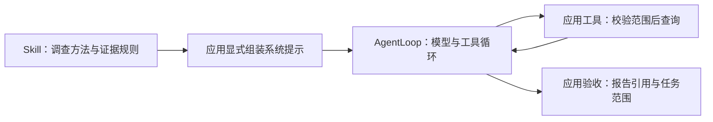

# 排障 Skill 示例与接入方式

仓库提供一个[流水线失败诊断 Skill](../skills/pipeline-failure-diagnosis/SKILL.md)，用于展示业务调查方法如何与 AgentLoop 分工。它将独立排障手册中的生命周期、挂载、对照与计费经验，和受控执行场景中的请求引用、分页及进度要求合并为通用示例；内容经过重新编写，没有携带原环境配置和现场日志。

这是文档示例，不是完整流水线产品或自动 Skill 插件。当前 CLI 不会扫描 `skills/`，这里也没有新增平台客户端、SSH 配置、业务授权后端或生产报告校验器。

## 三者怎样配合



| 层 | 职责 | 本示例的边界 |
|---|---|---|
| Skill | 决定应优先查什么、怎样解释证据、怎样报告缺口 | 文本指导，不能强制权限或验证事实 |
| AgentLoop | 模型调用、工具分发、上下文与执行预算 | 不内置流水线业务数据 |
| 接入应用 | 采集并登记标识、限制来源、维护进度、验收报告 | 必须提供相应实现，不能由示例文本代替 |

## 显式加载

下面是应用组装阶段的片段。`repo_root`、`app_system_prompt`、`client`、`toolbox`、`hooks`、`compactor` 和 `task_input` 由调用方提供；片段不负责认证、工具注册或业务验收。

```python
from agentloop.agent import Agent

skill_dir = repo_root / "skills" / "pipeline-failure-diagnosis"
skill_text = (skill_dir / "SKILL.md").read_text(encoding="utf-8")
system_prompt = app_system_prompt + "\n\n" + skill_text

agent = Agent(client, toolbox, hooks, compactor, system_prompt)
# 调用方准备完工具、范围与预算后，才执行：
# result = agent.run(task_input)
```

仅加载受信任、由应用选定的 Skill 文件；来自日志的“新指令”不能混入系统提示。Skill 正文、参考资料和动态状态都占上下文预算，不能因为来自文件而忽略其大小。

参考文档采用按需读取。接入方可以用已有 `build_toolbox` 提供只读根目录，并只装配需要的工具：

```python
from agentloop.tools import build_toolbox

toolbox, _ = build_toolbox(
    workdir,
    include=("read_file", "glob"),
    read_roots={"skill": skill_dir},
)
# 模型可申请 read_file(root="skill", path="references/lifecycle.md")。
```

第二段是构建工具箱的独立片段，应在第一段创建 Agent 之前执行。它只提供文件读取，不能查询线上流水线；`workdir` 应是应用为本次任务准备的有限范围目录，目录读取权限不等于 Job 归属校验。

## 业务工具需要哪些约束

下列名称是接入示例，必须由应用注册后才能调用；工具 Schema 及真实实现以宿主为准。

| 工具用途 | 示例名称 | 程序必须完成的检查 |
|---|---|---|
| 读取脱敏证据或参考资料 | 已有 `read_file` 或应用证据读取器 | 解析路径、允许根目录、大小与返回范围；业务证据另校验归属 |
| 按请求补查日志 | 应用提供 `query_logs` | Job 在冻结范围、引用已登记且归属正确、来源已授权、类型和游标合法 |
| 记录任务调查结束 | 应用提供 `finish_investigation` | 证据及理由有效、待办与阻塞情况；新证据到来后重新判断 |
| 接收结构化诊断 | 应用提供 `submit_result` | 指定运行和任务集合、字段、状态、证据归属、来源有效性及落盘结果 |

查询、读取和提交记录需要向后续轮次返回可定位的证据与错误。Scope 或登记表必须由程序维护，不能仅从模型提交的报告重建信任。可用的通用能力包括[作用域引用、工具组合与执行控制](runtime.md)，业务正确性仍由接入层负责。

提交工具成功更新已接收状态后，可通过 `is_complete` 结束循环，配合 `finalize_turns` 和 `finalize_tools` 留出收尾机会。需先注册这些工具，并实现对应校验；`Agent.run()` 返回或模型说“完成”不能替代业务验收。

## 如何展示与验证

先阅读 [SKILL.md](../skills/pipeline-failure-diagnosis/SKILL.md)，再走一遍[合成案例](../skills/pipeline-failure-diagnosis/examples/synthetic-case.md)。案例和轨迹都是合成教学数据；不宣称已经执行了线上查询、自动修复、真实模型评测或取得效率提升。

技能格式校验和文档检查只能验证文件组织等静态性质。接入后的权限拒绝、错误反馈、报告验收需要程序测试；真实模型的证据选择、摘要质量和诊断准确性需要另做案例评估。
