# AgentLoop 实现手册

> 从一次请求进入 Loop 到上下文归档与回读，读懂一个 Coding Agent 如何连接模型、
> 工具、权限、上下文与命令行。

本文对应 AgentLoop `0.1.1`。它不是“调用一次大模型 API”的示例，而是一套可运行、
可测试的最小 Agent Harness。你可以把模型理解为驾驶员，把 Harness 理解为方向盘、
仪表盘、刹车和道路规则。

## 目录

1. [学完能得到什么](#1-学完能得到什么)
2. [先跑起来](#2-先跑起来)
3. [项目地图](#3-项目地图)
4. [一条请求如何跑完](#4-一条请求如何跑完)
5. [内部消息协议](#5-内部消息协议)
6. [核心循环逐段读](#6-核心循环逐段读)
7. [工具系统](#7-工具系统)
8. [Hooks 与权限闸门](#8-hooks-与权限闸门)
9. [上下文压缩](#9-上下文压缩)
10. [多模型适配与故障切换](#10-多模型适配与故障切换)
11. [CLI 如何组装所有模块](#11-cli-如何组装所有模块)
12. [测试如何证明行为](#12-测试如何证明行为)
13. [动手扩展](#13-动手扩展)
14. [边界、风险与生产化方向](#14-边界风险与生产化方向)
15. [推荐阅读顺序](#15-推荐阅读顺序)
16. [术语表](#16-术语表)

---

## 1. 学完能得到什么

完成这份手册后，你应该能回答下面这些问题：

- Agent 为什么需要循环，而普通聊天只调用一次模型？
- 模型如何“请求执行工具”，执行结果又怎样回到模型？
- 为什么 `tool_use` 和 `tool_result` 必须通过 ID 配对？
- 为什么权限判断应该放在工具执行之前，并通过 Hook 接入？
- 上下文快满时，为什么不能粗暴删除旧消息？
- OpenAI 与 Anthropic 的工具调用格式不同，如何共用同一个核心循环？
- 模型超时、限流、上下文超限分别在哪一层处理？
- 如何给这个项目增加一个工具，而不修改核心循环？

AgentLoop 刻意只实现理解这些问题所需的最小结构：

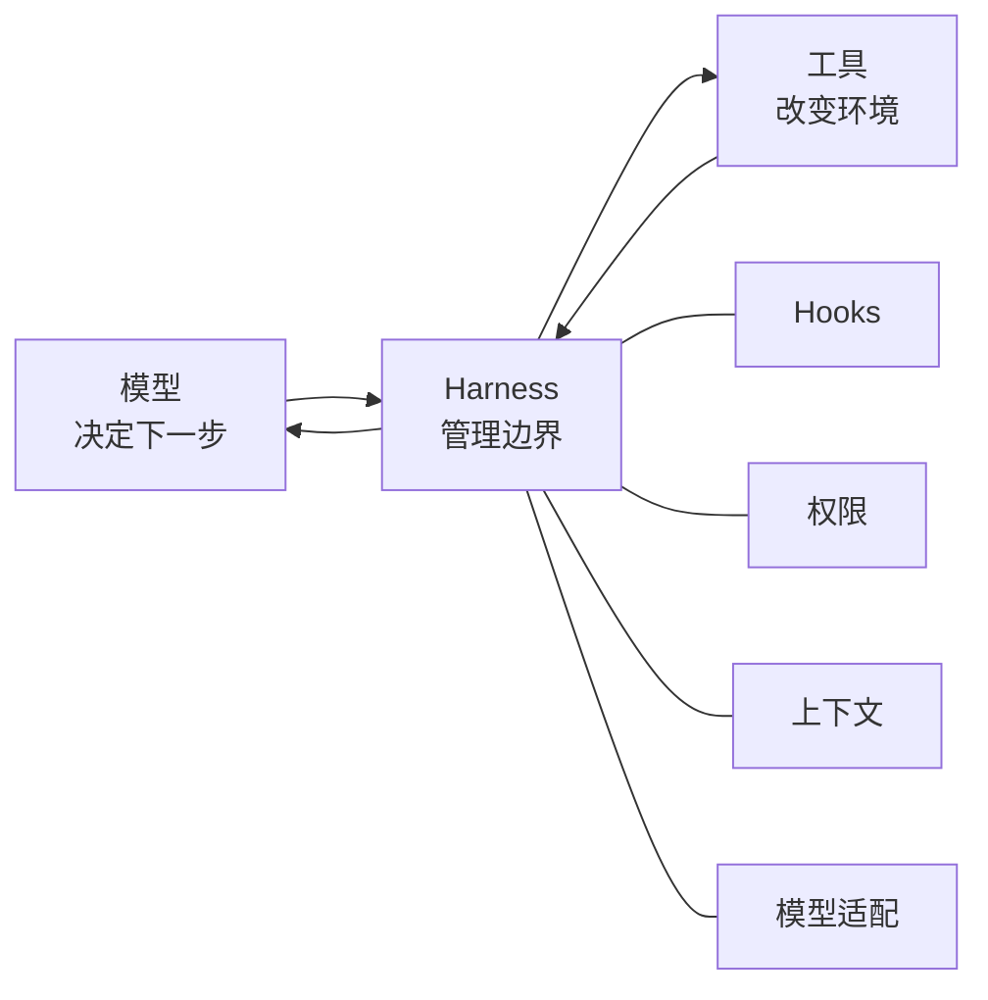

核心观点只有一句：

> 模型负责提出动作，Harness 负责让动作可执行、可约束、可观察、可继续。

---

## 2. 先跑起来

### 2.1 环境要求

- Python 3.10 或更高版本
- 一个受支持模型的 API Key，或者本地 OpenAI 兼容服务
- macOS、Linux，或能提供 `bash` 的环境

先确认版本。系统自带的 Python 3.9 不在支持范围内：

```bash
python3 --version
```

### 2.2 安装

```bash
git clone https://github.com/still0123/agentloop.git
cd agentloop
python3.11 -m venv .venv
source .venv/bin/activate
python -m pip install -e ".[dev]"
cp .env.example .env
```

`-e` 表示 editable install。修改源码后不需要重复安装。

### 2.3 配置模型

例如使用 DeepSeek：

```dotenv
AGENTLOOP_MODEL=deepseek-chat
DEEPSEEK_API_KEY=sk-...
```

使用本地 Ollama：

```dotenv
AGENTLOOP_MODEL=llama3
AGENTLOOP_BASE_URL=http://localhost:11434/v1
AGENTLOOP_API_KEY=ollama
```

`.env` 已被 `.gitignore` 忽略，不要提交真实密钥。

### 2.4 运行

单次任务：

```bash
python -m agentloop "列出当前目录里的 Python 文件"
```

连续会话：

```bash
python -m agentloop
```

输入 `q`、`quit` 或 `exit` 退出。

### 2.5 不配 API Key 也能验证

测试使用脚本化的 `MockClient`，完全不访问网络：

```bash
make check
```

它依次执行格式检查、静态检查和完整的离线单元测试。

---

## 3. 项目地图

```text
agentloop/
├── agentloop/
│   ├── agent.py       # 唯一 Agent Loop
│   ├── tools.py       # 工具定义、注册与执行
│   ├── hooks.py       # 四类生命周期 Hook
│   ├── permission.py  # bash 权限闸门
│   ├── budget.py      # 完整请求的本地预算估算
│   ├── compact.py     # 分级上下文管理与检查点
│   ├── models.py      # 模型协议适配、路由、重试、Fallback
│   ├── cli.py         # 默认组装与 REPL
│   ├── web.py         # 本地 Web 服务、事件、会话与权限审批
│   ├── web_ui.html    # 浏览器交互界面
│   └── __main__.py    # python -m agentloop
├── tests/             # 离线测试套件
├── docs/              # 学习文档
├── .env.example       # 模型配置模板
├── Makefile           # 常用开发命令
└── pyproject.toml     # 包信息、依赖和 Ruff 配置
```

模块依赖方向：

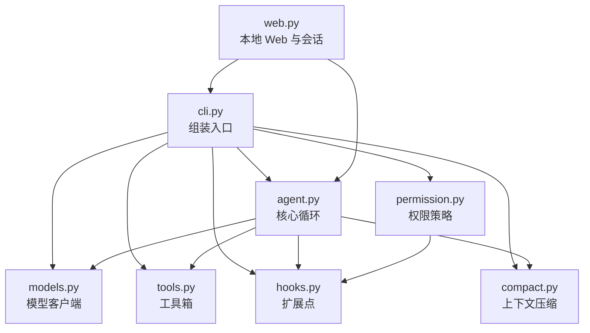

这张图有两个值得注意的地方：

1. `permission.py` 不被 `agent.py` 直接依赖，而是作为 `PreToolUse` Hook 注册。
2. `models.py` 把不同厂商格式统一后，`agent.py` 不需要知道正在调用谁。

---

## 4. 一条请求如何跑完

假设用户输入：

```text
读取 README.md 的前 20 行
```

一次完整往返大致如下：

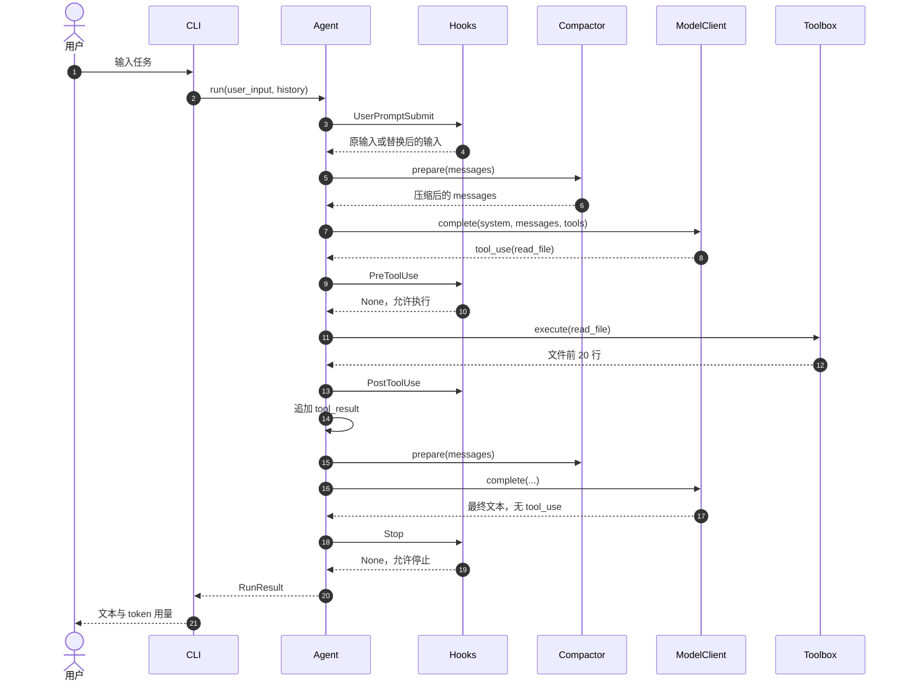

模型第一次没有直接回答，因为它缺少文件内容。它先返回一个结构化工具请求：

```python
{
    "type": "tool_use",
    "id": "toolu_001",
    "name": "read_file",
    "input": {"path": "README.md", "limit": 20},
}
```

工具执行后，Harness 把结果按同一个 ID 回填：

```python
{
    "type": "tool_result",
    "tool_use_id": "toolu_001",
    "content": "# AgentLoop ...",
}
```

模型第二次拿到真实文件内容，才生成最终答案。

---

## 5. 内部消息协议

AgentLoop 内部统一使用 Anthropic 风格的 content blocks。消息仍然只有
`user` 和 `assistant` 两种角色，但 `content` 可以是字符串，也可以是块列表。

### 5.1 普通消息

```python
{"role": "user", "content": "列出 Python 文件"}
```

### 5.2 模型请求工具

```python
{
    "role": "assistant",
    "content": [
        {
            "type": "tool_use",
            "id": "toolu_000",
            "name": "glob",
            "input": {"pattern": "**/*.py"},
        }
    ],
}
```

### 5.3 工具结果

```python
{
    "role": "user",
    "content": [
        {
            "type": "tool_result",
            "tool_use_id": "toolu_000",
            "content": "agentloop/agent.py\nagentloop/tools.py",
        }
    ],
}
```

为什么工具结果使用 `user` 角色？因为在线格式里，工具输出属于模型下一轮要消费的外部
输入。OpenAI 协议会在适配层把它展开成独立的 `role=tool` 消息。

### 5.4 最重要的不变量

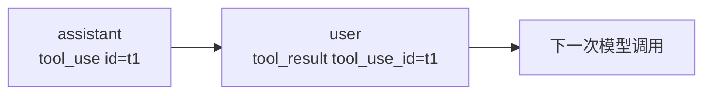

`tool_use` 和 `tool_result` 必须：

- ID 一致；
- 顺序相邻；
- 压缩历史时成对保留或成对移除。

如果只留下 `tool_result`，模型 API 会收到一个找不到来源的结果，通常直接拒绝请求。
这也是压缩模块里“配对保护”代码存在的原因。

---

## 6. 核心循环逐段读

入口是 [`Agent.run`](../agentloop/agent.py)。它的状态机很小：

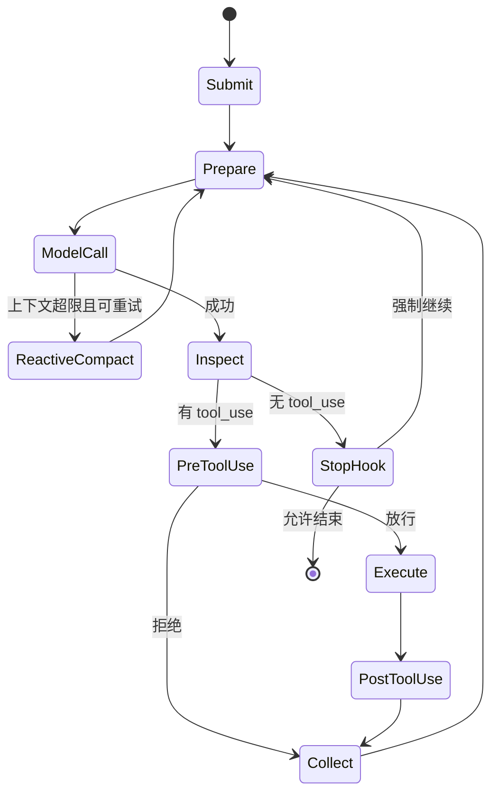

下面按代码执行顺序拆开。

### 6.1 输入预处理

```python
replaced = self.hooks.trigger("UserPromptSubmit", user_input)
if isinstance(replaced, str) and replaced:
    user_input = replaced
```

Hook 可以替换输入。典型用途是注入仓库规则、当前分支或用户身份。核心循环不关心替换
逻辑，只接收最终字符串。

### 6.2 复制历史并追加新问题

```python
messages = list(messages) if messages else []
messages.append(
    {
        "role": "user",
        "content": user_input,
        "_request_id": "...",
        "_request_text": original_request,
    }
)
```

浅复制列表避免直接修改调用方传入的历史。每个外部用户请求还会生成 `_request_id`，并保存
入口原文 `_request_text`：输入 Hook 即使改写了送往模型的内容，检查点中的 `user_requests`
仍可保存用户最初写下的要求。发送给模型前，这些内部字段会被移除；调用方仍应把返回的
`RunResult.messages` 作为下一轮历史。

### 6.3 每轮先压缩，再调用模型

```python
while True:
    messages = self.compactor.prepare(
        messages,
        current_request=original_request,
        system_prompt=self.system_prompt,
        tools=self.toolbox.defs,
    )
    model_messages = [
        {k: v for k, v in message.items()
         if k not in {"_request_id", "_request_text", "_origin"}}
        for message in messages
    ]
    response = self.client.complete(self.system_prompt, model_messages, self.toolbox.defs)
```

循环没有“规划”“权限”“路由”等分支。它只做两件事：

1. 准备上下文；
2. 请求模型决定下一步。

### 6.4 上下文超限后的补救

```python
except Exception as exc:
    if reactive_retries < self.reactive_retries and _is_prompt_too_long(exc):
        messages = self.compactor.reactive_compact(
            messages,
            current_request=original_request,
            system_prompt=self.system_prompt,
            tools=self.toolbox.defs,
        )
        reactive_retries += 1
        continue
    raise
```

完整请求预算使用本地估算器，默认也不是厂商精确 tokenizer。即使主动压缩认为没超限，API
仍可能返回 `prompt_too_long`。此时历史会按更小目标重新 checkpoint、落盘和压缩，然后重试一次。

这里重试的是“重新组织输入”，不是盲目重复相同请求。

### 6.5 累计 token 与保存模型回复

```python
for key in usage:
    usage[key] += response.usage.get(key, 0)
turns += 1
messages.append({"role": "assistant", "content": response.blocks})
```

不同模型的 token 字段已经在适配器中统一成：

```python
{"input_tokens": 0, "output_tokens": 0}
```

### 6.6 判断继续还是结束

```python
tool_calls = [block for block in response.blocks if block.get("type") == "tool_use"]
```

- 有 `tool_use`：执行工具，再进入下一轮。
- 没有 `tool_use`：触发 `Stop` Hook；没有反对意见就返回。

所以 Agent Loop 的唯一自然退出信号是“模型不再请求工具”。

### 6.7 最大轮数保护

```python
if turns >= self.max_turns:
    return RunResult(..., stopped_reason="max_turns")
```

模型可能反复尝试失败工具，也可能陷入无效规划。`max_turns` 是 Harness 的机械保险，
默认值为 40。

### 6.8 工具调用的三段式

```python
blocked = self.hooks.trigger("PreToolUse", block)
if blocked is not None:
    # 把拒绝原因包装成 tool_result
    ...
else:
    output = self.toolbox.execute(block)
    self.hooks.trigger("PostToolUse", block, output)
```

关键不是“拒绝后抛异常”，而是“拒绝也形成工具结果”。模型能读到失败原因并选择另一条
路线，Agent 循环不会中断。

### 6.9 Todo 提醒

每轮工具调用后检查是否使用过 `todo_write`。连续三轮没有更新计划，就追加一条提醒文本。
提醒仍然走消息协议，而不是在 Python 里接管模型决策。

---

## 7. 工具系统

入口是 [`tools.py`](../agentloop/tools.py)。

### 7.1 注册表结构

每个工具由四部分组成：

```python
@dataclass
class ToolDef:
    name: str
    description: str
    input_schema: dict
    handler: Callable
```

- `name`：模型调用时使用的稳定标识；
- `description`：告诉模型何时调用；
- `input_schema`：JSON Schema，限制参数形状；
- `handler`：真正执行操作的 Python 函数。

工具箱只做查表分发：

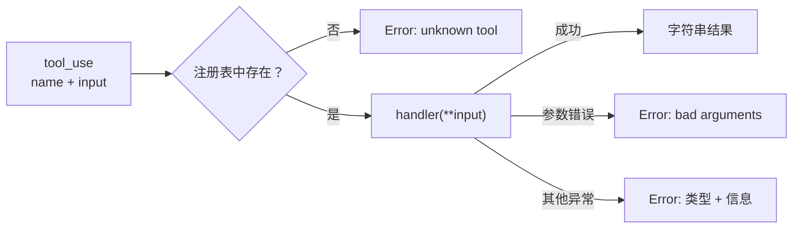

所有执行结果都转成字符串。这样工具层的普通错误会成为模型可读信息，不会炸掉循环。

### 7.2 内置工具

| 工具 | 作用 | 关键约束 |
|---|---|---|
| `bash` | 在工作区运行 shell 命令 | 60 秒默认超时，输出最多 200,000 字符 |
| `read_file` | 分页读取 UTF-8 文本 | 路径必须位于工作区；`offset` 为 1 起始行，单页有行数和字符上限 |
| `search_file` | 在文本中定向查找字面量 | 返回带行号的有限上下文；限制匹配数、扫描量与输出大小 |
| `write_file` | 创建或覆盖文本 | 自动创建父目录 |
| `edit_file` | 替换首个匹配文本 | 找不到旧文本时返回错误 |
| `glob` | 按模式查找文件 | 最多回传 500 个结果 |
| `todo_write` | 覆盖会话计划 | 最多 20 项，只能有一个进行中 |

### 7.3 `safe_path` 的作用

```python
resolved = (workdir / candidate).resolve()
if not resolved.is_relative_to(workdir):
    raise ValueError(...)
```

它先解析 `..` 和符号链接，再判断最终路径是否仍在工作区。下面两种写法都会被拒绝：

```text
../outside.txt
/tmp/outside.txt
```

注意：`safe_path` 只保护文件工具。`bash` 可以访问更大范围，因此必须依赖权限层和运行
环境隔离。这里是职责分离，不代表 shell 已经安全。

### 7.4 为什么工具异常不直接抛出

工具失败通常是可恢复事件。例如文件不存在时，模型可以先调用 `glob` 查找正确路径。
如果 `Toolbox.execute` 把异常抛到最外层，整次任务就会结束，模型失去自我修正机会。

不可恢复的程序错误仍可能发生在模型客户端、Hook 或 Harness 自身，它们不会全部被工具
层吞掉。

---

## 8. Hooks 与权限闸门

### 8.1 四个生命周期事件

入口是 [`hooks.py`](../agentloop/hooks.py)。

| 事件 | 调用时机 | 非 `None` 返回值的含义 |
|---|---|---|
| `UserPromptSubmit` | 用户输入进入历史前 | 替换用户输入 |
| `PreToolUse` | 工具执行前 | 阻止执行，返回拒绝原因 |
| `PostToolUse` | 工具执行后 | 当前实现只用于观察 |
| `Stop` | 模型准备结束时 | 注入新消息并强制继续 |

Hook 按注册顺序执行，并在首个非 `None` 返回值处短路：

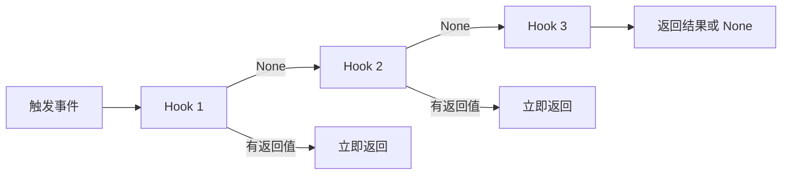

这意味着 Hook 顺序是行为的一部分。默认组装中权限 Hook 先注册，工具日志 Hook 后注册；
被权限拒绝的调用不会进入后续执行。

### 8.2 三道权限闸门

入口是 [`permission.py`](../agentloop/permission.py)。

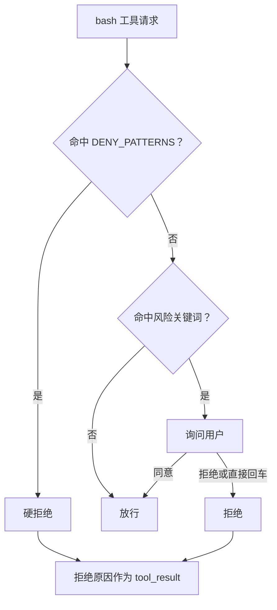

三层分别是：

1. **硬拒绝**：如 `rm -rf /`、`mkfs`、`shutdown`，不询问；
2. **风险识别**：如 `rm `、`chmod 777`、管道到 `sh`；
3. **人工确认**：默认拒绝，只有 `y` 或 `yes` 放行。

### 8.3 必须诚实看待它的边界

当前实现是教学级字符串匹配，不是安全沙箱。它可能：

- 被命令变形、脚本间接调用或编码绕过；
- 对字符串中的无害文本误报；
- 无法限制 CPU、内存、网络和文件系统访问；
- 无法识别 `python -c` 内部的破坏性操作。

生产环境应把同一闸门位置替换成容器、系统调用策略、最小权限凭据和结构化命令解析。

---

## 9. 上下文压缩

入口是 [`compact.py`](../agentloop/compact.py)。这是项目中状态约束最多的模块。

### 9.1 为什么需要压缩

Agent 每一轮都会把模型回复和工具结果追加到历史中。读取大文件、运行测试或长时间 REPL
都会快速消耗上下文窗口。

不能简单删除旧消息，因为旧消息里可能包含：

- 用户原始目标；
- 已修改文件和关键决策；
- 工具调用与结果配对；
- 尚未完成的约束；
- 可恢复的大输出路径。

### 9.2 状态与完整请求预算

`messages` 是按发生顺序保存的 `list[dict]`：它便于追加消息、按位置切片和保护工具调用配对。
工具箱使用 `dict[str, ToolDef]`，按名称查 handler。每次模型调用前，
`Agent` 把系统提示、工具定义和消息传给 `Compactor.prepare(...)`；它计算的是完整请求，
不是只计算消息文本。

`RequestBudget` 将 `system + tools + messages` 的序列化内容及协议包装开销相加，并预留模型
输出与安全余量。默认估算器按 UTF-8 字节数计数，方便在没有厂商 tokenizer 时保守控制大小；
它不是任何提供商的精确 token 数。CLI 默认窗口为 64,000、输出预留 8,000、安全余量 2,000，
均可通过 `AGENTLOOP_CONTEXT_TOKENS`、`AGENTLOOP_MAX_TOKENS`、`AGENTLOOP_CONTEXT_MARGIN`
调整。消息 JSON 的 `char_limit` 也要满足。

压缩状态放进一条带 `[Compacted]` 或 `[Reactive compact]` 前缀的 user 消息：

| 字段 | 保存内容 |
|---|---|
| `current_request` | 当前用户请求原文，兼容旧检查点 |
| `user_requests` | 有序 List；每项含 `source_id` 与原始 `text`，不是模型摘要 |
| `summary` | 上次有效摘要加本次新增历史得到的增量摘要 |
| `transcript` | 本次压缩前完整消息快照的相对路径 |
| `pending_transcripts` | 摘要失败、截断或当前预算放不下时待下次重放的归档路径 List |
| `revision`、`summarized_messages` | 检查点演进计数 |
| `mode`、`summary_error`、`schema_version` | 降级状态、错误类型和格式版本 |

大工具结果原文保存为 `.task_outputs/tool-results/<sha256>.txt`，内容以哈希命名而非模型给出的
调用 ID；压缩前消息快照或待重放增量保存为 `.transcripts/transcript-时间-随机值.json`。两类路径都是
相对工作区的字符串。
这些文件提供可回读证据，并不构成跨会话的语义长期记忆或自动知识召回。

### 9.3 分级处理：先归档，再决定是否摘要

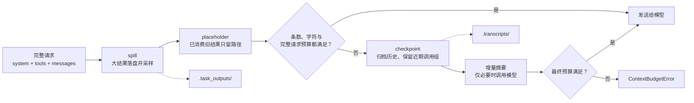

| 阶段 | 触发条件 | 动作 | 摘要接口调用 |
|---|---|---|---|
| spill | 最新工具结果批次过大，或完整请求已经超预算 | 原文落盘；消息保留首尾及错误片段和路径 | 0 |
| placeholder | 较早工具结果超过占位阈值 | 保存原文后替换为可回读路径 | 0 |
| checkpoint / summary | 消息数量、字符限制或完整请求预算仍不满足 | 归档完整历史，保留近期调用组；对未概括增量做摘要 | 最多 1 |
| fallback | 摘要失败、摘要响应被截断或仍无法装入预算 | 优先保留旧摘要与原文路径，未处理增量进入待重放队列 | 不增加调用 |

`prepare` 不再调用旧的 `_snip` 管线；`_snip` 仅保留为兼容性的内部辅助方法。实际主路径是
`spill → placeholder → checkpoint/增量摘要`。大结果也不保证会先完整送到模型：如果它本身
会超预算，程序先保存原文，再让模型看到有界预览与回读位置。

### 9.4 原文怎样落盘与回读

假设一个工具返回 100,000 字符：

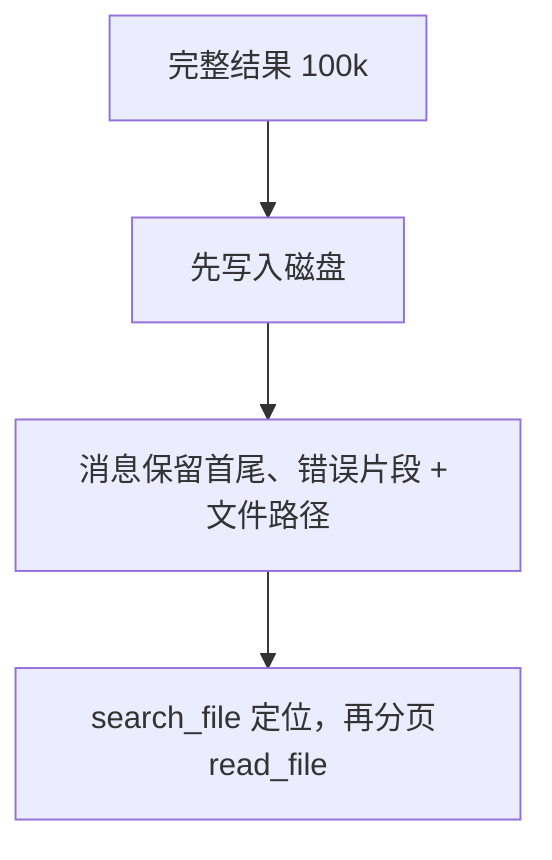

`spill` 针对最新一批过大的工具结果，先写原文再放预览，并复用已有的有效原文引用。
`placeholder` 针对较早的已消费结果，也会先保存原文或复用已有引用，才替换成路径；两者都不
通过“直接删除文本”减量。模型需要细节时可以先 `search_file` 找到证据行，再用
`read_file(path=..., offset=..., limit=...)` 分页读取。

### 9.5 采样、配对与回读

落盘预览不是只截取开头：`_sample_text` 保留首尾，并抽取 `error`、`exception`、
`failed`、`fatal`、`traceback`、`exit code` 附近片段。摘要输入也会保留近期证据和工具名、
参数、结果的关联。工具层的 shell 输出超过 200,000 字符时已经截断，这部分无法由压缩层恢复。

压缩只能移除完整调用组，不能留下孤儿结果：

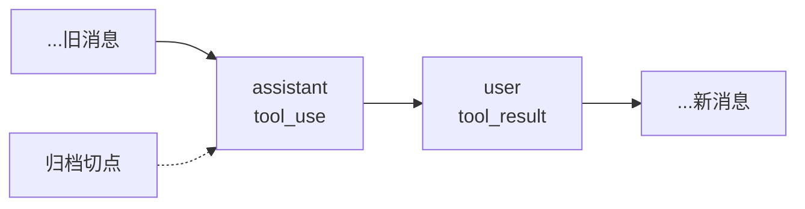

如果近期尾部从 `tool_result` 开始，checkpoint 会前移以保留对应的 `tool_use`；如果预算仍不够，
就将二者一起归档。`read_file` 限制每页行数和字符数，并通过 `offset` 翻页；`search_file` 还限制
匹配数、输出字符数与最多 10 MB 的源文件扫描量，避免回读本身再次撑满上下文。

### 9.6 增量摘要与失败恢复

第一次 checkpoint 把需要概括的历史作为 `new_history` 交给摘要模型。后续 checkpoint 发送
“上一次有效摘要 + 新增历史”，而不是反复摘要全部会话。摘要按完整消息组加入请求；只有首个
组本身超过摘要输入预算时才继续缩小其采样。后续组放不下时不计入本次已摘要数量，会保留为
待处理历史。

若摘要客户端不可用、返回空文本、返回过长文本，或 `finish_reason` 具有明确的异常结束原因，
程序不把半截输出当新摘要：优先保留旧 `summary`，归档本次失败的新增历史，并将路径加入
`pending_transcripts`。缺失 `finish_reason` 时按兼容路径接受，无法据此确认是否截断。
只有再次触发摘要时才会读取待处理归档。若受保护的用户原文、
系统提示或工具定义本身已超过本地预算，会抛出
`ContextBudgetError`，而不是悄悄删除要求。

### 9.7 主动压缩与被动补救

- `prepare`：每次模型调用前执行，属于主动管理；
- `reactive_compact`：API 明确报上下文超限后执行，属于一次性补救。

后者将当前目标缩到原请求的一半左右，重新走 checkpoint 流程，并尽量保留最近五条消息。
`Agent` 默认只允许补救一次，避免在错误识别或服务异常时无限重试。补救成功后返回的消息继续
进入同一轮 ReAct 循环；它不改变工具协议或用户请求 ledger。

---

## 10. 多模型适配与故障切换

入口是 [`models.py`](../agentloop/models.py)。

### 10.1 统一边界

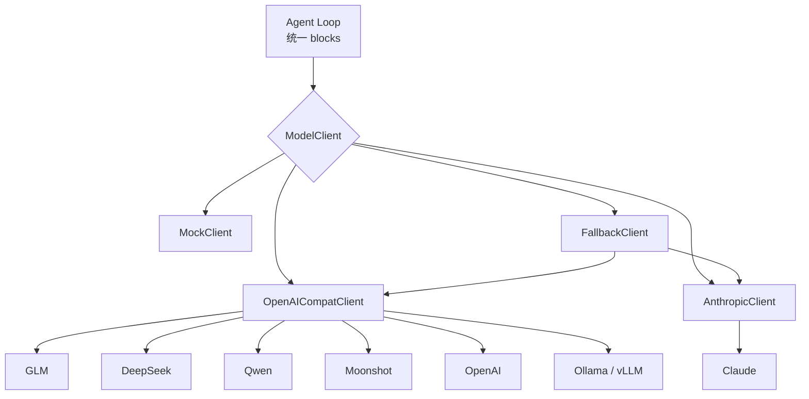

所有客户端暴露同一个方法：

```python
complete(system: str, messages: list, tools: list) -> ModelResponse
```

返回值统一为：

```python
ModelResponse(
    text="...",
    blocks=[...],
    usage={"input_tokens": 10, "output_tokens": 5},
)
```

### 10.2 OpenAI 格式转换

内部的：

```python
{"type": "tool_result", "tool_use_id": "t1", "content": "ok"}
```

会被 `_openai_wire_messages` 转成：

```python
{"role": "tool", "tool_call_id": "t1", "content": "ok"}
```

模型响应中的 `tool_calls[].function.arguments` 是 JSON 字符串，适配器负责解析成内部
`input` 字典。解析失败时不会伪造有效参数，而是保留在 `{"_raw": ...}` 中，后续工具
执行会返回可见错误。

### 10.3 提供商选择优先级

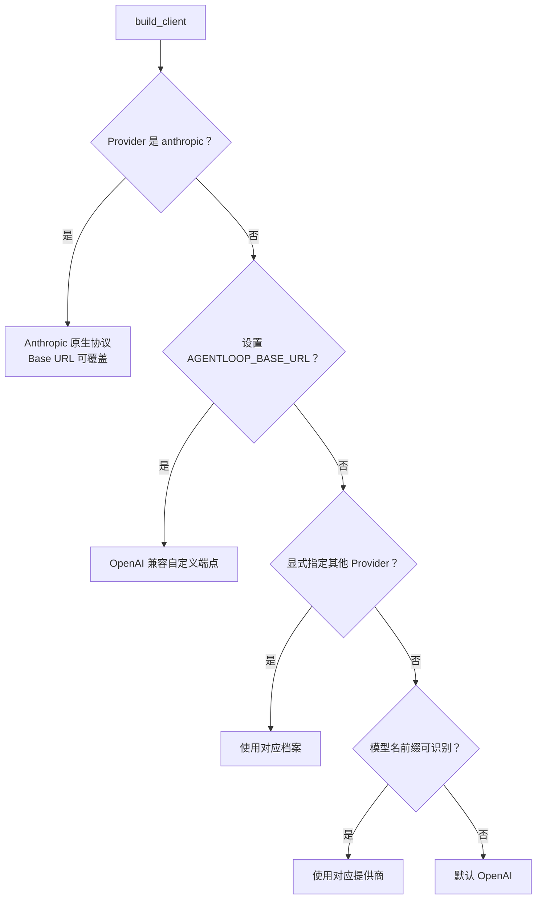

显式选择 `anthropic` 会优先走原生协议；其他情况下只要设置了自定义 Base URL，
就按 OpenAI 兼容协议处理。没有自定义端点时，才依次使用显式 Provider、模型名前缀
和默认 OpenAI 档案。

### 10.4 重试与 Fallback 不是一回事

单个客户端内部会对这些错误重试：

- HTTP 429；
- HTTP 500、502、503、529；
- 超时；
- 传输错误。

退避时间是 `1s -> 2s -> 4s`。重试耗尽后统一抛出 `ModelError`。

`FallbackClient` 只捕获 `ModelError`，然后尝试下一个模型：

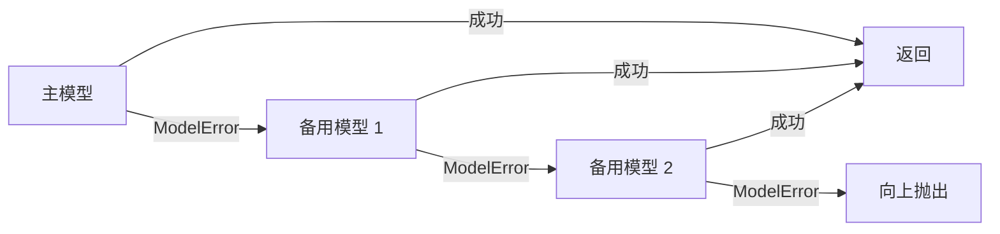

普通 Python 编程错误、`KeyboardInterrupt` 等不会被静默切换。这能避免真实 Bug 被
错误包装成“模型不稳定”。

### 10.5 `MockClient` 为什么重要

它按预设脚本逐轮返回文本或工具调用：

```python
MockClient(
    [
        [("bash", {"command": "echo hi"})],
        "done",
    ]
)
```

这段脚本精确模拟“两轮模型交互”，同时记录每次收到的 system prompt、messages 和
tools。测试因此可以验证完整 Harness 行为，而不依赖网络、余额和模型随机性。

---

## 11. CLI 如何组装所有模块

入口是 [`build_default_agent`](../agentloop/cli.py)。

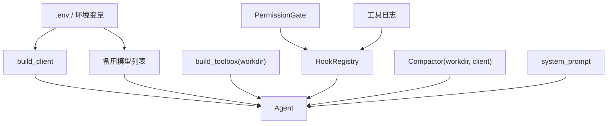

组装顺序体现了依赖关系：

1. 创建主模型和可选备用模型；
2. 把当前目录固定为工具工作区；
3. 注册权限与日志 Hook；
4. 让压缩器复用模型客户端生成摘要；
5. 注入 system prompt；
6. 构造 `Agent`。

### 11.1 单次模式

命令行带参数时，参数会拼成一个任务，只运行一次 `Agent.run`：

```bash
agentloop "run the tests"
```

### 11.2 REPL 模式

不带参数时，CLI 保存上一轮返回的 `result.messages`：

```python
session = result.messages
```

因此下一次输入能看到完整会话，压缩器负责控制历史增长。

### 11.3 `.env` 加载原则

内置 `_load_dotenv` 只处理简单的 `KEY=VALUE`，并且：

- 忽略空行和注释；
- 不覆盖已经存在的环境变量；
- 不解析 shell 展开、引号转义或多行值。

这是刻意的最小实现。复杂环境配置应交给进程管理器或成熟配置工具。

---

## 12. 测试如何证明行为

测试不是按文件凑覆盖率，而是按关键不变量组织：

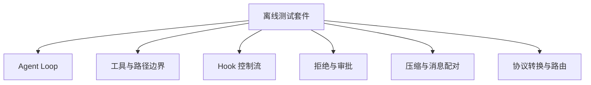

| 测试文件 | 主要证明 |
|---|---|
| `test_loop.py` | 工具往返、多工具顺序、最大轮数、会话连续性、token 累计 |
| `test_tools.py` | 文件读写、路径逃逸、glob、bash、Todo 约束 |
| `test_hooks.py` | 执行前拦截、停止续跑、输入替换、执行后观察 |
| `test_permission.py` | 硬拒绝、人工同意/拒绝、拒绝后循环继续 |
| `test_compact.py` | 归档、占位、检查点和工具调用组配对 |
| `test_budget.py` | 完整请求预算、输出预留、安全余量与自定义估算器 |
| `test_context_policy.py` | 超大最新结果落盘、请求 ledger、增量摘要、摘要输入采样与 reactive 缩减 |
| `test_context_recovery.py` | 归档回读、摘要失败降级、待重放历史、取消与真实 Loop 接回 |
| `test_models.py` | 提供商检测、OpenAI 转换、Fallback、环境配置 |
| `test_web.py` / `test_desktop.py` | 本地会话、事件接口和桌面入口 |

最值得先看的测试有三个：

1. `test_tool_roundtrip`：理解 Agent 为什么要调用模型两次；
2. `test_denial_reaches_model_not_crash`：理解拒绝也是一种结果；
3. `test_failed_incremental_summary_retains_old_summary_and_replays_delta`：理解失败不能覆盖旧摘要。

常用命令：

```bash
make test
make lint
make check
```

只运行一个行为：

```bash
pytest -q tests/test_loop.py::test_tool_roundtrip
```

---

## 13. 动手扩展

下面的练习按风险和理解成本排序。每次只改一个边界，并先补测试。

### 13.1 练习一：增加只读工具

目标：增加 `git_status` 工具，返回 `git status --short`。

步骤：

1. 在 `build_toolbox` 中定义 handler；
2. 使用 `box.add` 注册名称、描述和空对象 schema；
3. 在 `test_tools.py` 写一个最小测试；
4. 运行 `make check`；
5. 确认没有修改 `agent.py`。

学到的原则：加能力时优先扩展工具注册表，不膨胀核心循环。

### 13.2 练习二：增加审计 Hook

目标：把每次成功工具调用的名称和时间写到 JSON Lines 文件。

步骤：

1. 实现一个接收 `(block, output)` 的回调；
2. 注册到 `PostToolUse`；
3. 在临时目录运行 Mock Agent；
4. 断言每次调用恰好追加一行。

学到的原则：观察性逻辑挂在生命周期边界，不嵌进工具实现。

### 13.3 练习三：增加结构化权限规则

目标：只允许 `git`、`pytest`、`ruff` 三类 shell 命令。

步骤：

1. 用 `shlex.split` 解析命令首项；
2. 在 `PreToolUse` Hook 中实施 allowlist；
3. 默认拒绝无法解析或不在 allowlist 的命令；
4. 为引号、空命令、管道和 `&&` 增加测试。

学到的原则：安全规则应 fail-closed，解析失败不能默认放行。

### 13.4 练习四：给压缩摘要增加结构

目标：让摘要固定输出目标、完成项、待办项、文件和约束。

步骤：

1. 修改 `SUMMARY_SYSTEM`；
2. 保持摘要内容仍是普通文本，不改核心消息协议；
3. 用 MockClient 验证新增历史进入摘要输入，且 `user_requests` 不受摘要文本影响；
4. 保留完整 transcript 与 pending transcript 路径。

学到的原则：摘要只能降低上下文成本，不能成为唯一事实副本。

---

## 14. 边界、风险与生产化方向

AgentLoop 面向本地开发场景；下面列出其真实运行边界，以及面向更强隔离或多用户场景时的方向。

| 当前边界 | 影响 | 生产化方向 |
|---|---|---|
| bash 在宿主机直接执行 | 可访问工作区外资源 | 容器、沙箱、最小权限用户 |
| 权限规则是字符串匹配 | 可绕过、可误报 | 结构化策略与系统调用限制 |
| 工具调用串行 | 多工具延迟较高 | 对只读、无依赖工具做受控并发 |
| `.env` 解析简单 | 不支持复杂语法 | 进程环境或成熟配置库 |
| 本地 UTF-8 请求估算 | 与真实 tokenizer 有偏差，提供商仍可能拒绝 | 按模型接入 tokenizer，并保留 reactive compact |
| 摘要由当前模型生成 | 可能遗漏事实或被截断 | 原文归档、请求 ledger、摘要质量校验与失败重放 |
| 归档可定向回读 | 不会自行判断何时该读哪份证据 | 增加受控的检索/排序策略和来源标注 |
| 会话保存为本地 JSON | 适合单机单用户，不支持多进程并发写 | 数据库、文件锁或单写服务 |
| SSE 重放缓冲仅在内存 | 服务进程重启后不能重放瞬时事件 | 外部事件日志或消息队列 |

生产化之前至少要明确四个信任边界：

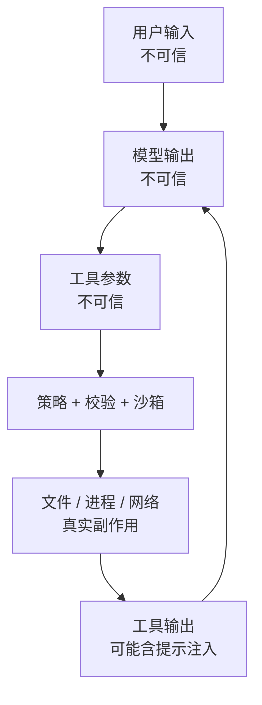

“模型说可以”不是授权，“字符串没命中拒绝表”也不是安全证明。

---

## 15. 推荐阅读顺序

### 第一遍：先看主干

1. `tests/test_loop.py::test_tool_roundtrip`
2. `agentloop/agent.py::Agent.run`
3. `agentloop/models.py::MockClient`
4. `tests/helpers.py::make_agent`

目标：看懂一次工具调用为什么是两次模型请求。

### 第二遍：看扩展边界

1. `agentloop/tools.py::Toolbox`
2. `agentloop/hooks.py::HookRegistry`
3. `agentloop/permission.py::PermissionGate`
4. 对应的 `test_tools.py`、`test_hooks.py`、`test_permission.py`

目标：看懂能力、策略和循环为何分开。

### 第三遍：看复杂状态

1. `agentloop/compact.py::Compactor.prepare`
2. `_spill_batch`
3. `_placeholder`
4. `_compact` 与 `_ask_summary`
5. `reactive_compact`
6. `tests/test_context_policy.py` 与 `tests/test_context_recovery.py`

目标：能手动画出消息切片前后，且不制造孤儿 `tool_result`。

### 第四遍：看外部协议

1. `_openai_wire_messages`
2. `OpenAICompatClient._parse`
3. `AnthropicClient`
4. `build_client`
5. `FallbackClient`

目标：理解适配器如何把外部差异挡在核心循环之外。

---

## 16. 术语表

| 术语 | 大白话解释 |
|---|---|
| Agent | 能根据环境反馈连续决定下一步的模型驱动程序 |
| Harness | 包住模型的运行框架，负责工具、权限、上下文和观测 |
| Agent Loop | “问模型 -> 执行工具 -> 回填结果 -> 再问模型”的循环 |
| Tool use | 模型提出的结构化工具调用请求 |
| Tool result | Harness 执行工具后返回给模型的结果 |
| Hook | 在固定生命周期位置插入策略或观察逻辑的回调 |
| Permission gate | 工具执行前决定放行或拒绝的边界 |
| Compaction | 在保留关键事实的前提下缩短消息历史 |
| Spill | 把大工具输出写入磁盘，消息里只留预览和路径 |
| Checkpoint | 一条 JSON 状态消息，连接用户请求 ledger、摘要、近期消息与归档路径 |
| Transcript | 压缩前落盘保存的完整消息历史 |
| Pending transcript | 摘要失败或本轮未能处理时，等待下次重放的历史路径 |
| Adapter | 在内部统一格式和外部厂商协议之间转换 |
| Retry | 同一客户端对暂时性失败再次请求 |
| Fallback | 当前客户端最终失败后切换到另一个模型 |
| REPL | 连续读取输入、执行并输出结果的交互式命令行 |

---

## 学习完成检查

你可以不用看源码回答这些问题时，说明已经掌握主干：

- [ ] 能画出一次工具调用的两轮模型交互。
- [ ] 能解释 `tool_use_id` 为什么不能丢。
- [ ] 能说清 Hook 的短路规则。
- [ ] 能区分文件路径保护和 shell 权限策略。
- [ ] 能说明完整请求预算、分级处理、检查点和回读怎样衔接。
- [ ] 能区分 retry、fallback 和 reactive compact。
- [ ] 能增加一个工具且不修改 `Agent.run`。
- [ ] 能用 MockClient 为新行为写离线测试。

回到 [README](../README.md)。
